English | [한국어](README_ko.md)

<p align="center">
  <h1 align="center">Agent Portal</h1>
  <p align="center">
    <strong>Enterprise Agentic AI Platform</strong><br/>
    Build, deploy, monitor, and govern AI agents with zero-copy data access and full observability
  </p>
</p>

<p align="center">
  <a href="#license"></a>
  <a href="https://github.com/ChangooLee/agent-portal"></a>
  <a href="#contributing"></a>
  
  
</p>

---

## The Problem We Solve

Enterprise AI adoption faces fundamental barriers that existing solutions fail to address:

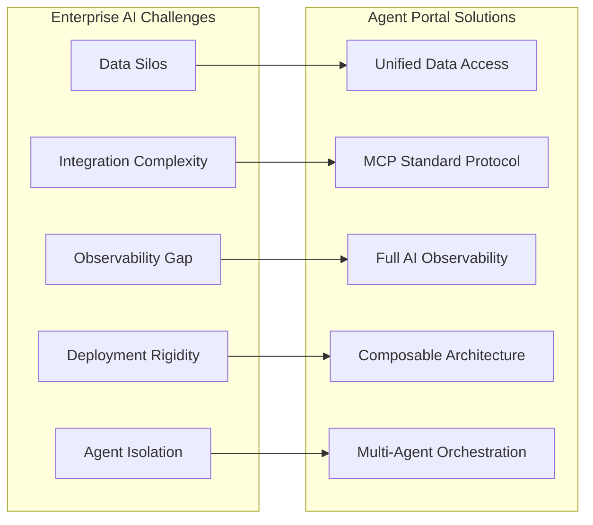

| Challenge | Industry Reality | Agent Portal Solution |
|-----------|------------------|----------------------|
| **Data Silos** | 73% of enterprise data remains inaccessible to AI systems | **Unified Data Access** — Connect any data source without data movement |
| **Integration Complexity** | Average enterprise uses 130+ SaaS apps, each requiring custom integration | **MCP Protocol** — Single standard for all agent-tool connections |
| **Observability Gap** | Most organizations cannot track AI costs at the agent level | **Full Observability** — Real-time cost, latency, token tracking per agent |
| **Deployment Rigidity** | Cloud-only or on-prem-only solutions limit enterprise flexibility | **Composable Architecture** — Deploy anywhere, scale anything |
| **Agent Isolation** | No standard protocol for agents to collaborate as tools | **Multi-Agent Orchestration** — Agents become tools for other agents |

---

## Our Philosophy

> *"MCP provides a universal, open standard for connecting AI systems with data sources, replacing fragmented integrations with a single protocol."*  
> — [Anthropic, Model Context Protocol](https://modelcontextprotocol.io/)

### 🔗 Unified Data Access, Not Data Movement

Connect to any data source—databases, APIs, MCP servers, legacy systems—**without copying or migrating data**. Users access information by permission, not by knowing where it lives. Your data stays where it is; agents come to it.

### 💰 Cost-Aware Intelligence

Every agent call is observable. Route simple tasks to efficient models, complex reasoning to capable ones. **Make informed decisions with real-time cost and performance metrics.** No more surprise bills or black-box AI spending.

### 🧩 Composable, Not Monolithic

Every component—agents, data connectors, workflows, monitoring—**operates independently**. Deploy on-premises, in the cloud, or hybrid. Scale what you need, replace what you want. No vendor lock-in, no all-or-nothing decisions.

### 🤖 Agents as Tools

Agents don't just run—they **become tools for other agents**. Build sophisticated multi-agent orchestrations where specialized agents collaborate autonomously. A financial analyst agent can invoke a data retrieval agent, which in turn queries multiple databases.

### 🌐 Open Standards First

Built on **MCP** (Anthropic), **OpenTelemetry** (CNCF), **LiteLLM** (100+ models). No proprietary protocols, no vendor dependencies. Your investment in Agent Portal is an investment in open, portable AI infrastructure.

---

## Example Usage

Ask your AI assistant:

- **📊 Data Analysis** — "Show me last quarter's revenue trends from the database"
- **🔍 Corporate Filings** — "Get Hyundai Motor's latest annual report (DART)"
- **📈 Multi-LLM Chat** — "Compare GPT-4o and Claude-3.5 responses for this question"
- **⚡ Agent Execution** — "Run the Text-to-SQL agent to find top 10 customers by sales"

---

## Why Agent Portal?

> *"By 2028, 33% of enterprise software applications will include agentic AI, up from less than 1% in 2024, enabling 15% of day-to-day work decisions to be made autonomously."*  
> — [Gartner, 2024](https://www.gartner.com/en/newsroom/press-releases/2024-10-21-gartner-says-agentic-ai-is-the-next-frontier-for-enterprise-automation)

**Agentic AI** is the next-generation AI paradigm that goes beyond simple generative AI to enable **autonomous decision-making and task execution**. However, most enterprises face the following challenges:

| Challenge | Agent Portal Solution |
|-----------|----------------------|
| 🔒 Difficulty connecting legacy systems to AI | **Zero-copy Data Federation** — Direct DB connection, no data movement |
| 📊 Opaque AI costs and performance | **OpenTelemetry Native Observability** — Track all calls, real-time cost monitoring |
| 🔐 AI governance and security concerns | **Enterprise-grade Security** — Kong Gateway, RBAC, Guardrails |
| 🔧 Agent development/operation complexity | **Unified Platform** — Design-deploy-monitor-manage in one environment |

### Key Benefits

- **🚀 Faster Time to Value**: Instantly leverage existing data assets with AI agents
- **📈 Complete Visibility**: Traceability and auditability of all AI activities
- **🔌 Legacy-Friendly Integration**: Adopt AI capabilities without changing existing systems
- **🌐 Vendor Independence**: Based on open standards (MCP, OpenTelemetry, LiteLLM)

---

## Core Features

Agent Portal supports the entire AI agent lifecycle with a **Use → Build → Operate** structure.

### 🎯 Use — Interact with AI

| Feature | Description |
|---------|-------------|
| **💬 Multi-LLM Chat** | Unified access to 100+ models: OpenAI, Anthropic, Azure, Bedrock, Google, Ollama |
| **🤖 AI Agents** | Specialized agents: Text-to-SQL, Corporate Disclosure Analysis (DART), Report Generation |
| **🗃️ Data Cloud** | Query existing databases with natural language (MariaDB, PostgreSQL, ClickHouse) |
| **🔍 AI Search** | AI-powered web search based on Perplexica |
| **📓 AI Notebook** | Interactive AI notebook |
| **📊 Reports** | AI-based automatic report generation |

### 🛠️ Build — Develop Agents

| Feature | Description |
|---------|-------------|
| **🧩 Agent Builder** | Create conversational, no-code, and code-based (LangGraph) agents |
| **⚡ Workflow Builder** | Visual workflow editor |
| **🔗 MCP Integration** | [Model Context Protocol](https://modelcontextprotocol.io/) server management — Anthropic standard |
| **🗄️ Data Connections** | Multi-database connection management (zero-copy) |
| **📚 Knowledge Base** | Document/knowledge-based RAG configuration |
| **🛡️ Guardrails** | Safety policy and filter settings |
| **📝 Prompt Management** | Prompt template version control |
| **📊 Evaluations** | Model evaluation and leaderboard |

### ⚙️ Operate — Operations & Management

| Feature | Description |
|---------|-------------|
| **📈 Monitoring Dashboard** | Real-time cost, latency, error rate, token usage tracking |
| **🔄 Trace Viewer** | Full stack trace of Agent/LLM calls |
| **🚪 API Gateway** | Kong-based routing, authentication, Rate Limiting |
| **👥 User Management** | RBAC-based user/team permission management |
| **⚙️ System Settings** | Centralized platform configuration management |

---

## Screenshots

### Splash Screen

*Welcome screen with AI Agent Portal branding and navigation*

### Use — Interact with AI

#### Main Dashboard
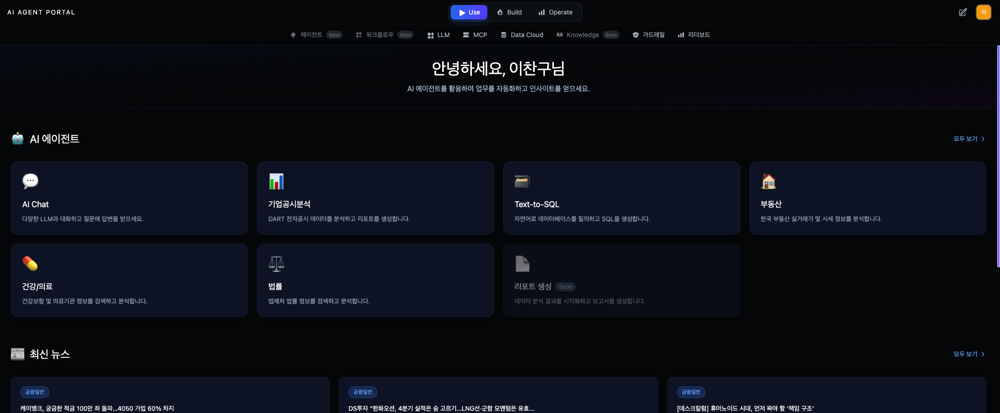
*Landing page with agent cards and quick access to all features*

#### Multi-LLM Chat
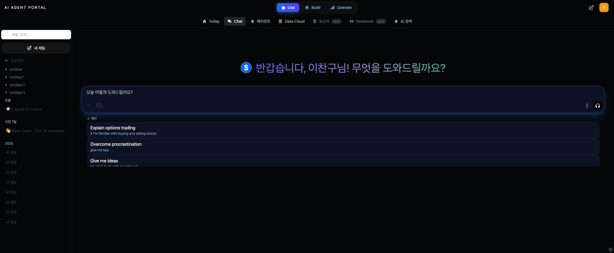
*Unified access to 100+ LLM models with real-time conversation*

#### AI Agents
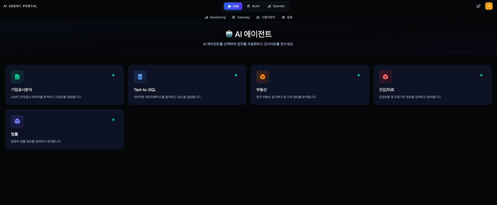
*Browse and launch specialized AI agents for different tasks*

#### DART Corporate Disclosure Analysis

*AI-powered corporate disclosure analysis with multi-agent orchestration*

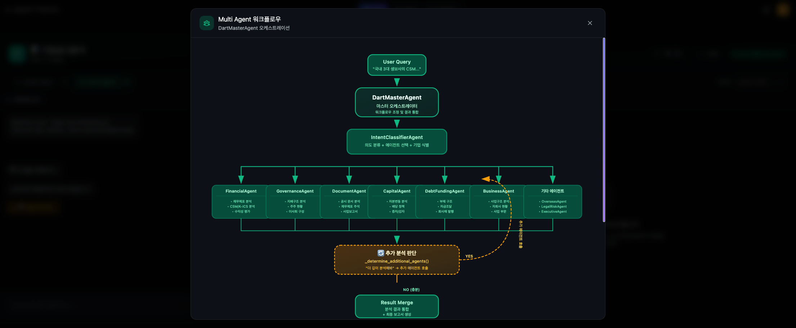
*Multi-agent workflow orchestration with specialized agents for financial, governance, and document analysis*

#### Text-to-SQL
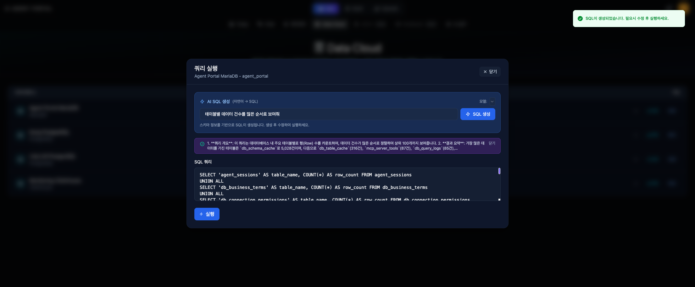
*Natural language to SQL conversion with zero-copy database access*

#### AI Search (Perplexica)
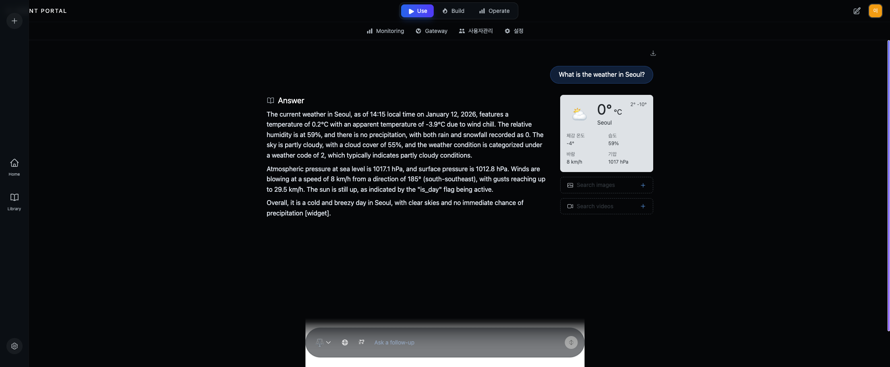
*AI-powered web search with source citations and real-time results*

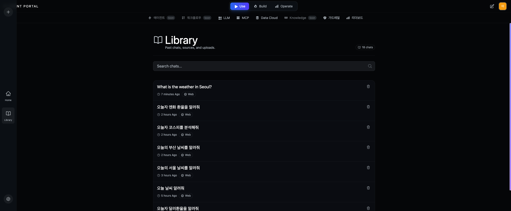
*Browse and manage past search conversations and results*

### Build — Develop Agents

#### LLM Management
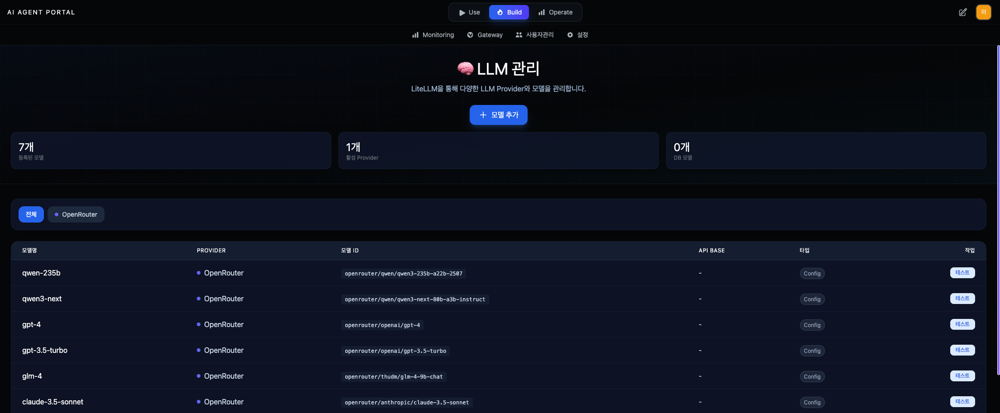
*Configure and manage 100+ LLM models from a single interface*

#### MCP Server Management
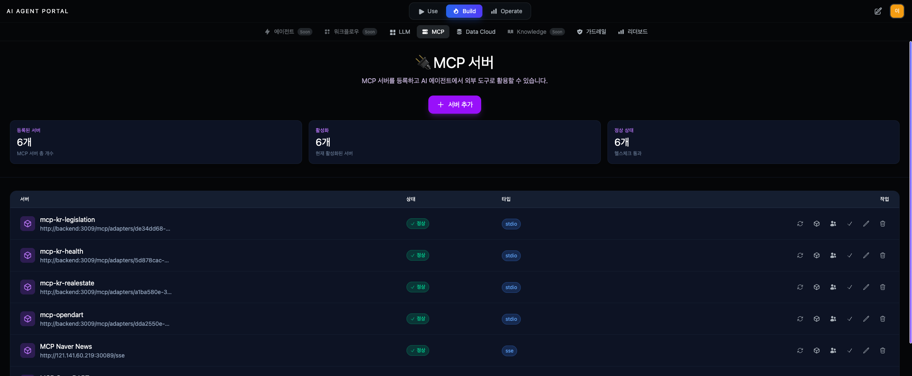
*Manage Model Context Protocol servers with Anthropic standard*

#### Data Cloud Management
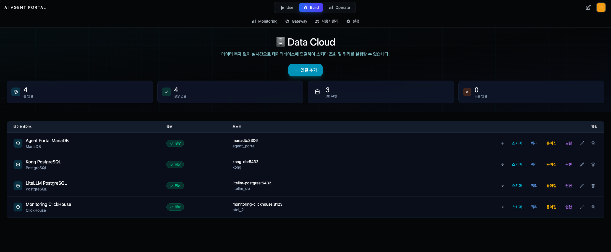
*Configure and manage database connections with zero-copy access*

#### Guardrails
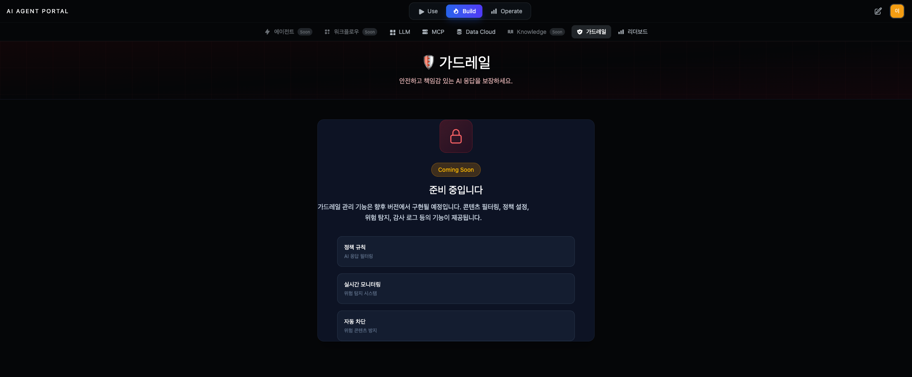
*Configure safety policies and content filtering (Coming Soon)*

#### Model Evaluations
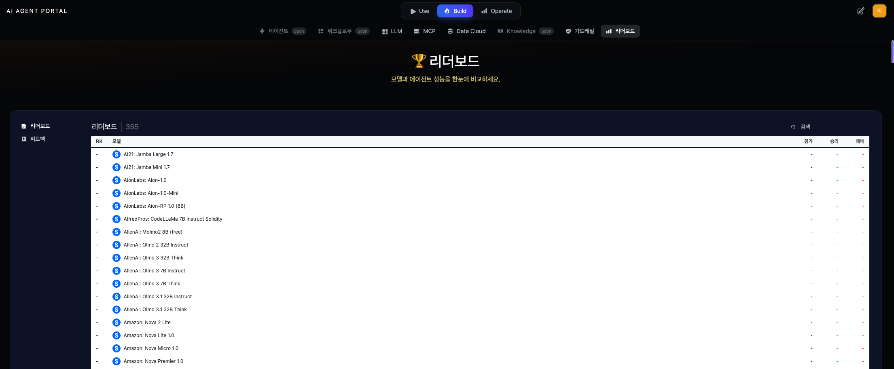
*Evaluate and compare LLM models with leaderboard rankings*

### Operate — Operations & Management

#### Monitoring Dashboard
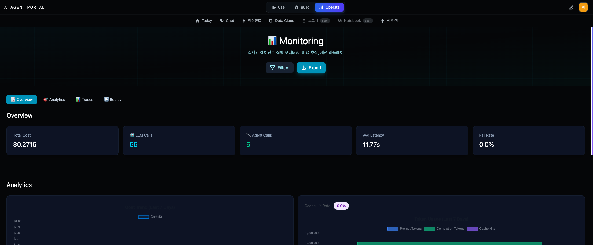
*Real-time cost, latency, error rate, and token usage tracking*

#### Trace Viewer
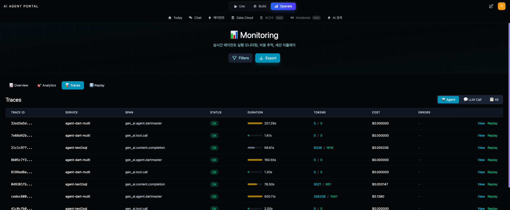
*Detailed trace view showing agent execution, LLM calls, tool usage, and performance metrics*

#### API Gateway
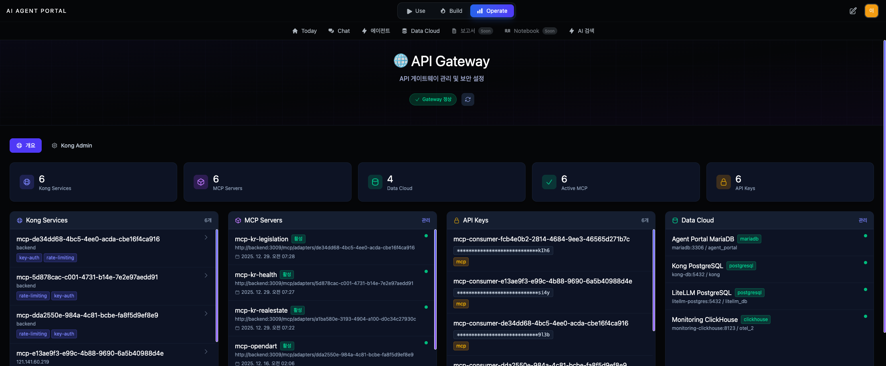
*Kong-based API gateway management with service routing, authentication, and rate limiting*

#### User Management
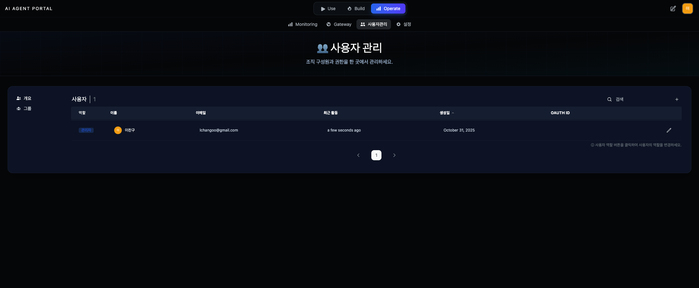
*RBAC-based user and team management with role assignments*

#### System Settings
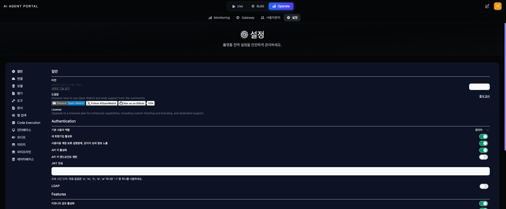
*Centralized platform configuration including authentication, features, and integrations*

---

## Technical Excellence

### AI Native Architecture

Agent Portal is designed on an **AI Native Infrastructure Stack**:

```
┌─────────────────────────────────────────────────────────────────┐
│  Application Layer      │ Chat, Agents, Reports, Notebooks      │
├──────────────────────────┼──────────────────────────────────────┤
│  Agent Framework         │ LangGraph, Tool-Use Patterns          │
├──────────────────────────┼──────────────────────────────────────┤
│  LLM Gateway             │ LiteLLM (100+ models)                 │
├──────────────────────────┼──────────────────────────────────────┤
│  Context Protocol        │ MCP (Anthropic Standard)              │
├──────────────────────────┼──────────────────────────────────────┤
│  Data Federation         │ Zero-copy DB Connectors               │
├──────────────────────────┼──────────────────────────────────────┤
│  Observability           │ OpenTelemetry + ClickHouse            │
├──────────────────────────┼──────────────────────────────────────┤
│  API Gateway             │ Kong (Auth, Rate-Limit, Routing)      │
├──────────────────────────┼──────────────────────────────────────┤
│  Compute & Storage       │ Docker Compose, MariaDB, Redis        │
└─────────────────────────────────────────────────────────────────┘
```

### Enterprise-Grade Infrastructure

| Capability | Technology | Benefit |
|------------|------------|---------|
| **LLMOps Observability** | OpenTelemetry + ClickHouse | Trace, cost, and token tracking for all LLM calls |
| **AgentOps Monitoring** | Custom Dashboard | Agent execution flow, tool calls, error analysis |
| **API Security** | Kong Gateway | Key-Auth, JWT, Rate-Limiting, ACL |
| **Data Governance** | RBAC + Guardrails | Role-based access control, safety policies |
| **Scalability** | Docker Compose + Microservices | Independent scaling per service |

### Open Standards

Agent Portal adopts **vendor-agnostic open standards**:

| Standard | Origin | Purpose |
|----------|--------|---------|
| **[Model Context Protocol](https://modelcontextprotocol.io/)** | Anthropic | Agent-tool connection standard (stdio, SSE, Streamable HTTP) |
| **[OpenTelemetry](https://opentelemetry.io/)** | CNCF | Distributed tracing standard |
| **[LiteLLM](https://litellm.vercel.app/)** | MIT OSS | 100+ LLM unified gateway |
| **[Kong Gateway](https://konghq.com/)** | Apache-2.0 | Cloud-native API gateway |

---

## Architecture

**Single Port Architecture (Port 3009)**

All services are accessed through a single port (3009). The BFF (Backend for Frontend) acts as the main entry point.


### Data Flows

| Pipeline | Flow |
|----------|------|
| **WebUI** | Browser → BFF (3009) → WebUI Backend (8080) |
| **LLM Call** | Browser → BFF → LiteLLM (4000) → Claude/GPT/etc |
| **Monitoring** | LiteLLM → OTEL → ClickHouse → Dashboard |
| **Text-to-SQL** | Browser → BFF → LangGraph Agent → DB |
| **MCP Gateway** | Browser → BFF → Kong (8000) → MCP Servers |

---

## Services

### Core Services

| Service | External Port | Purpose | Health Check |
|---------|--------------|---------|--------------|
| **backend** | 3009 | FastAPI BFF (Main Entry Point) | http://localhost:3010/health |
| **webui** | - | Portal UI (SvelteKit + Open-WebUI) | Via BFF proxy |
| **litellm** | 4000 | LLM Gateway (100+ models) | http://localhost:4000/health |
| **mariadb** | 3306 | App Database | - |
| **clickhouse** | 8124 | Trace Storage | http://localhost:8124/ping |
| **kong** | 8004 | API Gateway | http://localhost:8004/status |

### Support Services

| Service | Port | Purpose |
|---------|------|---------|
| redis | 6379 | Session/Cache |
| prometheus | 9090 | Metrics Collection |
| chromadb | 8001 | Vector DB for RAG |
| minio | 9000/9001 | Object Storage |
| otel-collector | 4317/4318 | Trace Collection |

---

## Quick Start

### 1. Clone and Configure

```bash
git clone https://github.com/ChangooLee/agent-portal.git
cd agent-portal

cp .env.example .env
# Set API keys in .env file (OPENAI_API_KEY, ANTHROPIC_API_KEY, etc.)
```

### 2. Start Services

```bash
# Start all services
docker compose up -d

# Run health check
./scripts/health-check.sh

# Or use the automated start and test script
./scripts/start-and-test.sh
```

### 3. Access

| URL | Description |
|-----|-------------|
| http://localhost:3010 | **Portal UI (Main Entry Point)** |
| http://localhost:3010/docs | Backend API Documentation |
| http://localhost:4000/ui | LiteLLM Admin UI |
| http://localhost:1337 | Kong Admin (Konga) |

---

## Docker Deployment

### Using Docker Compose (Recommended)

```bash
# Start all services
docker compose up -d

# View logs
docker compose logs -f

# Stop all services
docker compose down
```

### Environment Variables

| Variable | Description | Default |
|----------|-------------|---------|
| `OPENAI_API_KEY` | OpenAI API Key | - |
| `ANTHROPIC_API_KEY` | Anthropic API Key | - |
| `LITELLM_MASTER_KEY` | LiteLLM Admin Key | - |
| `DATABASE_URL` | MariaDB Connection String | - |

---

## Security

- **Never share your API keys**
- Keep your `.env` file secure
- Use appropriate Rate Limiting
- Monitor your API usage
- Store sensitive data in environment variables
- Use RBAC for access control

---

## Troubleshooting

### Common Issues

- **Authentication Failures**:
  - Ensure your API key is valid and active
  - Check if the API key has required permissions

- **Connection Issues**:
  - Check your internet connection
  - Ensure all Docker containers are running
  - Verify firewalls aren't blocking connections

### Debugging Tools

```bash
# Check service status
docker compose ps

# View logs
docker compose logs backend --tail=50 -f

# Check port conflicts
lsof -i :3010

# Health check
./scripts/health-check.sh
```

---

## Documentation

| Document | Description |
|----------|-------------|
| [AGENTS.md](./AGENTS.md) | AI Agent Technical Reference |
| [docs/MONITORING_SETUP.md](./docs/MONITORING_SETUP.md) | Monitoring Setup Guide |
| [docs/KONGA_SETUP.md](./docs/KONGA_SETUP.md) | Kong Gateway Setup Guide |
| [docs/TEXT2SQL_AGENT.md](./docs/TEXT2SQL_AGENT.md) | Text-to-SQL Agent Documentation |
| [docs/TESTING.md](./docs/TESTING.md) | Testing Guide |

---

## Roadmap

### Completed ✅

- [x] Portal Shell (Open-WebUI based)
- [x] LLM Gateway (LiteLLM, 100+ models)
- [x] Monitoring Dashboard (OTEL + ClickHouse)
- [x] Data Cloud (Zero-copy DB connectors)
- [x] Text-to-SQL Agent (LangGraph)
- [x] MCP Server Management
- [x] Kong API Gateway

### In Progress 🔧

- [ ] Agent Builder Integration (Langflow, Flowise)
- [ ] RBAC-based User/Team Permission Management
- [ ] Prompt Template Management
- [ ] Agent Marketplace

### Planned 📋

#### Core Platform Improvements
- [ ] **Agent-to-UI Test Automation**: Playwright + OTEL based UI testing and observability
- [ ] **Model Auto-Routing**: Optimal model selection based on OpenRouter metadata
- [ ] **Advanced Tool-Use Patterns**: LangGraph Plan→Execute→Validate→Retry loops
- [ ] **Data Cloud Semantic Layer**: Entity/metric standardization and RAG integration

#### Infrastructure & Operations
- [ ] **AI Native Stack Mapping**: Automated technology layer ↔ code mapping
- [ ] **MCP Auto-Maintenance**: Spec compliance checks and automated testing
- [ ] **Security Enhancement**: OPA policy engine, ABAC, audit trails

#### Agent Capabilities
- [ ] **High-Risk Domain Agents**: Safety guardrails for legal/medical/investment
- [ ] **Budget-Aware Agents**: Optimization based on budget policies
- [ ] **Agent Builder Enhancement**: Node-based flow editor
- [ ] **Memory Management Enhancement**: Session/long-term memory, TTL, permissions

> Detailed implementation guide: [AGENTS.md#14-future-development-epics](./AGENTS.md#14-future-development-epics)

---

## Development

### Local Development

```bash
# Backend (hot reload)
cd backend
pip install -r requirements.txt
uvicorn app.main:app --reload --host 0.0.0.0 --port 3009

# Frontend (hot reload)
cd webui
npm install && npm run dev
```

### Testing

```bash
./scripts/start-and-test.sh      # Automated start and test
./scripts/regression-test.sh     # Regression tests
./scripts/verify-network-paths.sh # Network path verification
```

### Rebuilding Services

```bash
# Single service
docker compose build --no-cache backend
docker compose up -d backend

# Full rebuild
docker compose down
docker compose build --no-cache
docker compose up -d
```

---

## Contributing

We welcome contributions! Agent Portal is **open source**, and we welcome all contributions.

### How to Contribute

1. **Fork** the repository
2. Create a feature branch (`git checkout -b feature/amazing-feature`)
3. Commit your changes (`git commit -m 'Add amazing feature'`)
4. Push to the branch (`git push origin feature/amazing-feature`)
5. Open a **Pull Request**

### Good First Issues

- Documentation improvements
- UI/UX enhancements
- Additional database connector support
- Monitoring dashboard widgets

### Development References

- [AGENTS.md](./AGENTS.md) — Technical reference
- [.cursorrules](./.cursorrules) — Development guidelines

---

## License

This project is licensed for **non-commercial, personal, research, and educational purposes only**. Commercial use, redistribution, and commercial use of derivative works are strictly prohibited. See the [LICENSE](LICENSE) file for details.

| Component | License |
|-----------|---------|
| Open-WebUI (Portal Shell) | AGPL-3.0 |
| LiteLLM | MIT |
| Kong Gateway (OSS) | Apache-2.0 |
| ClickHouse | Apache-2.0 |
| **Agent Portal Code** | Non-Commercial Personal Use Only |

---

<p align="center">
  <strong>Agent Portal</strong> — Enterprise Agentic AI Platform<br/>
  Made with ❤️ for an AI-native future
</p>

**Last Updated**: 2025-12-23
