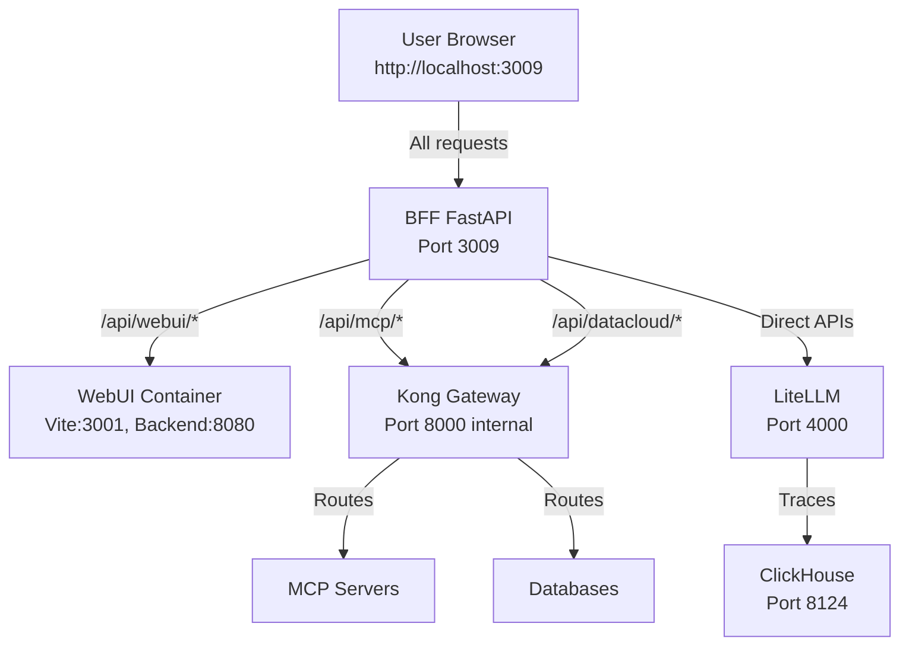

# Agent Portal

> **Enterprise AI Agent Platform**

AI 에이전트의 설계, 실행, 모니터링, 관리를 위한 통합 플랫폼

---

## Vision

**"모든 기업이 자사 데이터와 시스템에 연결된 AI 에이전트를 손쉽게 구축하고 운영할 수 있도록"**

### Core Values

| 가치 | 설명 |
|------|------|
| **유연한 인터페이스** | 채팅, 보고서, 웹검색 등 다양한 뷰 모드로 동일한 에이전트와 상호작용 |
| **확장 가능한 시스템 통합** | MCP(Model Context Protocol)를 통한 외부 시스템 연동 |
| **다양한 에이전트 생성** | 대화형, 노코드, 코드 기반(LangGraph) 모두 지원 |
| **즉시 테스트 및 반복** | 실시간 실행·검증·수정·재배포가 가능한 개발 사이클 |
| **프로덕션급 운영** | 모든 에이전트의 실행 추적, 비용 모니터링, 가드레일 정책 |
| **제로 카피 데이터 접근** | 기존 데이터베이스에 직접 연결하여 실시간 쿼리 및 분석 |

### Principles

- **100% 오픈소스 기반**: LiteLLM, Kong, ClickHouse, Open-WebUI
- **엔터프라이즈급 운영**: 멀티 유저·멀티 에이전트·멀티 워크스페이스
- **완전한 관측성**: OTEL 기반 트레이싱, 비용 추적, 성능 분석

---

## Architecture

**Single Port Architecture (Port 3009)**

모든 서비스가 단일 포트(3009)를 통해 접근됩니다. BFF(Backend for Frontend)가 메인 엔트리 포인트로 동작하며, WebUI Backend와 Kong Gateway를 프록시합니다.



### Network Flows

| Pipeline | Flow |
|----------|------|
| **WebUI Frontend** | Browser → BFF (3009) → Vite Dev Server (3001) or Static Files |
| **WebUI Backend** | Browser → BFF (3009) → WebUI Backend (8080) |
| **LLM Call** | Browser → BFF (3009) → LiteLLM (4000) → Claude/GPT/etc |
| **Monitoring** | LiteLLM → OTEL → ClickHouse → BFF → Dashboard |
| **Text-to-SQL** | Browser → BFF (3009) → LangGraph Agent → DB |
| **MCP Gateway** | Browser → BFF (3009) → Kong (8000) → MCP Servers |
| **DataCloud** | Browser → BFF (3009) → Kong (8000) → Databases |

---

## Services

### Core Services

| Service | External Port | Internal Port | Purpose | Health Check |
|---------|--------------|---------------|---------|--------------|
| **backend** | 3009 | 3009 | FastAPI BFF (Main Entry Point) | http://localhost:3009/health |
| **webui** | - | 3001 (Vite), 8080 (Backend) | Portal UI (SvelteKit + Open-WebUI) | Via BFF proxy |
| **litellm** | 4000 | 4000 | LLM Gateway | http://localhost:4000/health |
| **mariadb** | 3306 | 3306 | App Database | - |
| **clickhouse** | 8124 | 8123 | Trace Storage | http://localhost:8124/ping |
| **kong** | 8004 | 8000 | API Gateway (Internal only) | http://localhost:8004/status |
| **konga** | 1337 | 1337 | Kong Admin UI | http://localhost:1337 |

### Support Services

| Service | Port | Purpose |
|---------|------|---------|
| redis | 6379 | Cache |
| prometheus | 9090 | Metrics |
| chromadb | 8001 | Vector DB |
| minio | 9000/9001 | Object Storage |
| otel-collector | 4317/4318 | Trace Collection |

---

## Features

### 1. Data Cloud

**제로 카피 데이터베이스 연결**

| Database | Status | Driver |
|----------|--------|--------|
| MariaDB/MySQL | ✅ 지원 | pymysql |
| PostgreSQL | ✅ 지원 | psycopg2 |
| ClickHouse | ✅ 지원 | clickhouse-driver |
| Oracle | 🔧 드라이버 필요 | cx_Oracle |
| SAP HANA | 🔧 드라이버 필요 | hdbcli |
| Databricks | 🔧 드라이버 필요 | databricks-sql-connector |

### 2. Text-to-SQL Agent

**LangGraph 기반 Plan-and-Execute 패턴**

```
entry → analyze → generate → validate → fix (if needed) → execute → format → complete
```

- 다중 DB 지원 (Dialect 자동 감지)
- 스키마 캐싱 및 자동 갱신
- 에러 자동 복구 (최대 3회 재시도)
- OTEL 기반 전체 실행 추적

### 3. Monitoring Dashboard

**LiteLLM + OTEL + ClickHouse 기반 관측성**

| Tab | Content |
|-----|---------|
| **Overview** | Total Cost, LLM Calls, Agent Calls, Avg Latency, Fail Rate |
| **Analytics** | Cost Trend, Token Usage, Agent Flow Graph |
| **Traces** | Agent / LLM Call / All 서브탭으로 필터링 |

### 4. MCP Gateway

**Model Context Protocol 서버 관리**

- stdio, SSE, Streamable HTTP 연결 지원
- Kong Gateway를 통한 보안 (Key-Auth, Rate-Limiting)
- 프로젝트별 MCP 서버 할당

### 5. LLM Gateway

**LiteLLM Proxy 기반 멀티 LLM 관리**

- OpenAI, Anthropic, Azure, Bedrock, Google, Ollama 등 지원
- 모델별 비용 추적
- API Key 관리 및 사용량 제한

---

## Quick Start

### 1. Clone & Configure

```bash
git clone https://github.com/ChangooLee/agent-portal.git
cd agent-portal

cp .env.example .env
# .env 파일에서 API 키 설정 (OPENAI_API_KEY, ANTHROPIC_API_KEY 등)
```

### 2. Start Services

```bash
# Start all services
docker compose up -d

# Run health check
./scripts/health-check.sh

# Or use automated start and test script
./scripts/start-and-test.sh
```

### 3. Access

**Single Port Access (Port 3009)**

모든 서비스는 포트 3009를 통해 접근됩니다:

| URL | Description |
|-----|-------------|
| http://localhost:3009 | Portal UI (Main Entry Point) |
| http://localhost:3009/docs | Backend API Docs |
| http://localhost:3009/api/webui/* | WebUI Backend API (via BFF proxy) |
| http://localhost:3009/monitoring/* | Monitoring API |
| http://localhost:3009/mcp/* | MCP API |
| http://localhost:3009/datacloud/* | DataCloud API |

**Other Services**

| URL | Description |
|-----|-------------|
| http://localhost:4000/ui | LiteLLM Admin |
| http://localhost:1337 | Kong Admin (Konga) |

---

## Project Structure

```
agent-portal/
├── backend/                    # FastAPI BFF
│   ├── app/
│   │   ├── main.py            # App entry
│   │   ├── routes/            # API endpoints
│   │   │   ├── monitoring.py  # /monitoring/*
│   │   │   ├── datacloud.py   # /datacloud/*
│   │   │   ├── text2sql.py    # /text2sql/*
│   │   │   ├── mcp.py         # /mcp/*
│   │   │   └── gateway.py     # /gateway/*
│   │   ├── services/          # Business logic
│   │   └── agents/
│   │       └── text2sql/      # LangGraph Agent
│   └── requirements.txt
│
├── webui/                      # Open-WebUI fork
│   ├── src/
│   │   ├── routes/(app)/
│   │   │   └── admin/         # Admin pages
│   │   │       ├── monitoring/
│   │   │       ├── datacloud/
│   │   │       └── mcp/
│   │   └── lib/components/
│   └── vite.config.ts
│
├── config/
│   ├── litellm.yaml           # LLM models
│   ├── kong.yml               # Kong Gateway
│   └── prometheus.yml         # Metrics
│
├── scripts/
│   └── health-check.sh
│
├── docker-compose.yml
└── AGENTS.md                  # AI Agent reference
```


---

## Documentation

| Document | Description |
|----------|-------------|
| [AGENTS.md](./AGENTS.md) | AI Agent 기술 레퍼런스 |
| [docs/MONITORING_SETUP.md](./docs/MONITORING_SETUP.md) | 모니터링 설정 가이드 |
| [docs/KONGA_SETUP.md](./docs/KONGA_SETUP.md) | Kong Gateway 설정 가이드 |
| [docs/TEXT2SQL_AGENT.md](./docs/TEXT2SQL_AGENT.md) | Text-to-SQL Agent 설명서 |

---

## Development

### Port Structure

**Single Port Architecture (3009)**

- **BFF (Backend for Frontend)**: Port 3009 (Main Entry Point)
  - 모든 API 요청 처리
  - WebUI Backend 프록시 (`/api/webui/*`)
  - Kong Gateway 프록시 (`/api/mcp/*`, `/api/datacloud/*`)
  - 정적 파일 서빙 (개발: Vite Dev Server 프록시, 프로덕션: 빌드 파일)

- **WebUI Container**: 내부 포트만 사용
  - Vite Dev Server: 3001 (내부)
  - WebUI Backend: 8080 (내부)

- **Kong Gateway**: 내부 네트워크만 사용
  - Proxy: 8000 (내부)
  - Admin: 8001 (내부)

### Local Development

```bash
# Backend (hot reload)
cd backend
pip install -r requirements.txt
uvicorn app.main:app --reload --host 0.0.0.0 --port 3009

# Frontend (hot reload)
cd webui
npm install && npm run dev
# Vite Dev Server runs on port 3001 internally
# BFF proxies to Vite Dev Server for static files
```

### Testing

```bash
# Run automated start and test
./scripts/start-and-test.sh

# Run regression tests
./scripts/regression-test.sh

# Verify network paths
./scripts/verify-network-paths.sh
```

자세한 테스트 절차는 [docs/TESTING.md](./docs/TESTING.md)를 참조하세요.

### Service Rebuild

```bash
# Single service
docker compose build --no-cache backend
docker compose up -d backend

# Full rebuild
docker compose down
docker compose build --no-cache
docker compose up -d
```

### Logs

```bash
docker compose logs backend --tail=50 -f
docker compose logs webui --tail=50 -f
```

---

## Troubleshooting

### Port Conflict

```bash
lsof -i :8000
kill -9 <PID>
```

### DB Connection

```bash
# MariaDB
docker compose exec mariadb mariadb -uroot -prootpass -e "SELECT 1;"

# ClickHouse
curl http://localhost:8124/ping
```

### CORS Error

```typescript
// ❌ Direct call
fetch('http://localhost:8000/...')

// ✅ Use Vite proxy
fetch('/api/...')
```

---

## Roadmap

### Completed ✅

- [x] Portal Shell (Open-WebUI 기반)
- [x] LLM Gateway (LiteLLM)
- [x] Monitoring Dashboard (OTEL + ClickHouse)
- [x] Data Cloud (멀티 DB 연결)
- [x] Text-to-SQL Agent (LangGraph)
- [x] MCP Server 관리
- [x] Kong API Gateway

### In Progress 🔧

- [ ] 에이전트 빌더 통합 (Langflow, Flowise)
- [ ] 사용자/팀 권한 관리 (RBAC)
- [ ] 프롬프트 템플릿 관리
- [ ] 에이전트 마켓플레이스

### Planned 📋

- [ ] RAG Pipeline 통합
- [ ] 가드레일 정책 엔진
- [ ] 멀티 워크스페이스
- [ ] SSO 연동 (SAML, OIDC)

---

## License

| Component | License |
|-----------|---------|
| Open-WebUI (Portal Shell) | AGPL-3.0 |
| LiteLLM | MIT |
| Kong Gateway (OSS) | Apache-2.0 |
| ClickHouse | Apache-2.0 |
| 본 프로젝트 코드 | MIT |

---

## Contributing

1. Fork the repository
2. Create your feature branch (`git checkout -b feature/amazing-feature`)
3. Commit your changes (`git commit -m 'Add amazing feature'`)
4. Push to the branch (`git push origin feature/amazing-feature`)
5. Open a Pull Request

---

**Last Updated**: 2025-12-05
