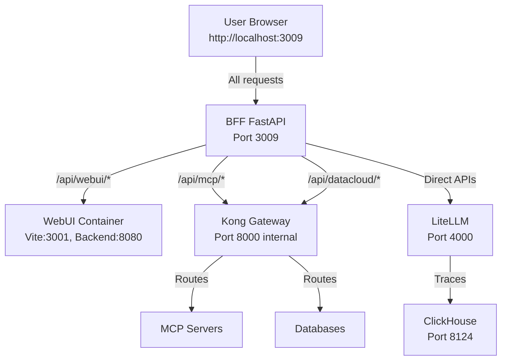

# Agent Portal

> **Enterprise AI Agent Platform**

AI 에이전트의 설계, 실행, 모니터링, 관리를 위한 통합 플랫폼

---

## Vision

**"모든 기업이 자사 데이터와 시스템에 연결된 AI 에이전트를 손쉽게 구축하고 운영할 수 있도록"**

### Core Values

| 가치 | 설명 |
|------|------|
| **유연한 인터페이스** | 채팅, 보고서, 웹검색 등 다양한 뷰 모드로 동일한 에이전트와 상호작용 |
| **확장 가능한 시스템 통합** | MCP(Model Context Protocol)를 통한 외부 시스템 연동 |
| **다양한 에이전트 생성** | 대화형, 노코드, 코드 기반(LangGraph) 모두 지원 |
| **즉시 테스트 및 반복** | 실시간 실행·검증·수정·재배포가 가능한 개발 사이클 |
| **프로덕션급 운영** | 모든 에이전트의 실행 추적, 비용 모니터링, 가드레일 정책 |
| **제로 카피 데이터 접근** | 기존 데이터베이스에 직접 연결하여 실시간 쿼리 및 분석 |

### Principles

- **100% 오픈소스 기반**: LiteLLM, Kong, ClickHouse, Open-WebUI
- **엔터프라이즈급 운영**: 멀티 유저·멀티 에이전트·멀티 워크스페이스
- **완전한 관측성**: OTEL 기반 트레이싱, 비용 추적, 성능 분석

---

## Architecture

**Single Port Architecture (Port 3009)**

모든 서비스가 단일 포트(3009)를 통해 접근됩니다. BFF(Backend for Frontend)가 메인 엔트리 포인트로 동작하며, WebUI Backend와 Kong Gateway를 프록시합니다.



### Network Flows

| Pipeline | Flow |
|----------|------|
| **WebUI Frontend** | Browser → BFF (3009) → Vite Dev Server (3001) or Static Files |
| **WebUI Backend** | Browser → BFF (3009) → WebUI Backend (8080) |
| **LLM Call** | Browser → BFF (3009) → LiteLLM (4000) → Claude/GPT/etc |
| **Monitoring** | LiteLLM → OTEL → ClickHouse → BFF → Dashboard |
| **Text-to-SQL** | Browser → BFF (3009) → LangGraph Agent → DB |
| **MCP Gateway** | Browser → BFF (3009) → Kong (8000) → MCP Servers |
| **DataCloud** | Browser → BFF (3009) → Kong (8000) → Databases |

---

## Services

### Core Services

| Service | External Port | Internal Port | Purpose | Health Check |
|---------|--------------|---------------|---------|--------------|
| **backend** | 3009 | 3009 | FastAPI BFF (Main Entry Point) | http://localhost:3009/health |
| **webui** | - | 3001 (Vite), 8080 (Backend) | Portal UI (SvelteKit + Open-WebUI) | Via BFF proxy |
| **litellm** | 4001 | 4000 | LLM Gateway | http://localhost:4001/health |
| **litellm-postgres** | 5433 | 5432 | PostgreSQL for LiteLLM | - |
| **mariadb** | 3306 | 3306 | App Database | - |
| **clickhouse** | 8125 (HTTP), 9002 (Native) | 8123, 9000 | Trace Storage | http://localhost:8125/ping |
| **kong** | 8004 | 8000 (Proxy), 8001 (Admin) | API Gateway (Internal only) | http://localhost:8004/status |
| **kong-db** | - | 5432 | PostgreSQL for Kong | - |
| **konga** | 1337 | 1337 | Kong Admin UI | http://localhost:1337 |
| **konga-db** | - | 5432 | PostgreSQL for Konga | - |

### Support Services

| Service | External Port | Internal Port | Purpose |
|---------|--------------|---------------|---------|
| redis | 6379 | 6379 | Cache |
| prometheus | 9092 | 9090 | Metrics |
| grafana | 3008 | 3000 | Metrics Dashboard |
| chromadb | 8005 | 8000 | Vector DB |
| minio | 9003 (API), 9004 (Console) | 9000, 9001 | Object Storage |
| otel-collector | 4319 (gRPC), 4320 (HTTP) | 4317, 4318 | Trace Collection |

### Agent Builders

| Service | External Port | Internal Port | Purpose |
|---------|--------------|---------------|---------|
| langflow | 7861 | 7860 | Langflow Agent Builder |
| flowise | 3002 | 3000 | Flowise Agent Builder |
| autogen-studio | 5050 | 5050 | AutoGen Studio (disabled) |

---

## Features

### 1. Data Cloud

**제로 카피 데이터베이스 연결**

| Database | Status | Driver |
|----------|--------|--------|
| MariaDB/MySQL | ✅ 지원 | pymysql |
| PostgreSQL | ✅ 지원 | psycopg2 |
| ClickHouse | ✅ 지원 | clickhouse-driver |
| Oracle | 🔧 드라이버 필요 | cx_Oracle |
| SAP HANA | 🔧 드라이버 필요 | hdbcli |
| Databricks | 🔧 드라이버 필요 | databricks-sql-connector |

### 2. Text-to-SQL Agent

**LangGraph 기반 Plan-and-Execute 패턴**

```
entry → analyze → generate → validate → fix (if needed) → execute → format → complete
```

- 다중 DB 지원 (Dialect 자동 감지)
- 스키마 캐싱 및 자동 갱신
- 에러 자동 복구 (최대 3회 재시도)
- OTEL 기반 전체 실행 추적

### 3. Monitoring Dashboard

**LiteLLM + OTEL + ClickHouse 기반 관측성**

| Tab | Content |
|-----|---------|
| **Overview** | Total Cost, LLM Calls, Agent Calls, Avg Latency, Fail Rate |
| **Analytics** | Cost Trend, Token Usage, Agent Flow Graph |
| **Traces** | Agent / LLM Call / All 서브탭으로 필터링 |

### 4. MCP Gateway

**Model Context Protocol 서버 관리**

- stdio, SSE, Streamable HTTP 연결 지원
- Kong Gateway를 통한 보안 (Key-Auth, Rate-Limiting)
- 프로젝트별 MCP 서버 할당

### 5. LLM Gateway

**LiteLLM Proxy 기반 멀티 LLM 관리**

- OpenAI, Anthropic, Azure, Bedrock, Google, Ollama 등 지원
- 모델별 비용 추적
- API Key 관리 및 사용량 제한

### 6. DART Agent

**기업공시분석 에이전트**

- DART(Data Analysis, Retrieval and Reporting Tool) 기업공시 데이터 분석
- SSE 스트리밍 지원
- 실시간 기업공시 정보 조회 및 분석

### 7. Agent Registry

**에이전트 등록 및 추적 시스템**

- Langflow, Flowise, Text2SQL, AutoGen 등 모든 에이전트 등록
- 에이전트별 실행 추적 및 모니터링
- 프로젝트별 에이전트 할당 및 관리

### 8. Projects & Teams

**프로젝트 및 팀 관리**

- 멀티 프로젝트 지원
- 팀 기반 협업 및 권한 관리
- 프로젝트별 모델 설정 및 리소스 할당

### 9. LLM Management

**LLM 모델 관리 UI**

- LiteLLM 모델 추가/수정/삭제
- Provider별 모델 목록 조회
- 모델 테스트 및 검증

---

## Quick Start

### 1. Clone & Configure

```bash
git clone https://github.com/ChangooLee/agent-portal.git
cd agent-portal

cp .env.example .env
# .env 파일에서 API 키 설정 (OPENAI_API_KEY, ANTHROPIC_API_KEY 등)
```

### 2. Start Services

```bash
# Start all services
docker compose up -d

# Run health check
./scripts/health-check.sh

# Or use automated start and test script
./scripts/start-and-test.sh
```

### 3. Access

**Single Port Access (Port 3009)**

모든 서비스는 포트 3009를 통해 접근됩니다:

| URL | Description |
|-----|-------------|
| http://localhost:3009 | Portal UI (Main Entry Point) |
| http://localhost:3009/docs | Backend API Docs |
| http://localhost:3009/api/webui/* | WebUI Backend API (via BFF proxy) |
| http://localhost:3009/monitoring/* | Monitoring API |
| http://localhost:3009/mcp/* | MCP API |
| http://localhost:3009/datacloud/* | DataCloud API |

**Other Services**

| URL | Description |
|-----|-------------|
| http://localhost:4001/ui | LiteLLM Admin |
| http://localhost:1337 | Kong Admin (Konga) |
| http://localhost:3008 | Grafana Dashboard |
| http://localhost:7861 | Langflow |
| http://localhost:3002 | Flowise |

---

## Project Structure

```
agent-portal/
├── backend/                    # FastAPI BFF
│   ├── app/
│   │   ├── main.py            # App entry, router registration
│   │   ├── routes/            # API endpoints
│   │   │   ├── chat.py        # /chat/*
│   │   │   ├── monitoring.py  # /api/monitoring/*
│   │   │   ├── datacloud.py   # /datacloud/*, /api/datacloud/*
│   │   │   ├── text2sql.py    # /text2sql/*, /api/text2sql/*
│   │   │   ├── mcp.py         # /mcp/*, /api/mcp/*
│   │   │   ├── gateway.py     # /gateway/*, /api/gateway/*
│   │   │   ├── llm.py          # /llm/*, /api/llm/*
│   │   │   ├── dart.py         # /dart/*, /api/dart/*
│   │   │   ├── agent_registry.py  # /agents/*
│   │   │   ├── agents.py       # /api/agents/*
│   │   │   ├── projects.py     # /api/projects/*
│   │   │   ├── teams.py        # /api/teams/*
│   │   │   ├── news.py         # /api/news/*
│   │   │   ├── observability.py  # /observability/*
│   │   │   ├── proxy.py        # /proxy/*
│   │   │   ├── embed.py        # Embedding API
│   │   │   ├── kong_admin.py   # Kong Admin API
│   │   │   └── webui_proxy.py  # WebUI Backend proxy
│   │   ├── services/          # Business logic (singletons)
│   │   │   ├── litellm_service.py
│   │   │   ├── llm_management_service.py
│   │   │   ├── monitoring_adapter.py
│   │   │   ├── datacloud_service.py
│   │   │   ├── mcp_service.py
│   │   │   ├── kong_service.py
│   │   │   ├── agent_registry_service.py
│   │   │   ├── agent_trace_adapter.py
│   │   │   ├── project_service.py
│   │   │   ├── webui_auth_service.py
│   │   │   └── langgraph_service.py
│   │   └── agents/
│   │       └── text2sql/      # LangGraph Text-to-SQL Agent
│   └── requirements.txt
│
├── webui/                      # Open-WebUI fork (SvelteKit)
│   ├── src/
│   │   ├── routes/(app)/
│   │   │   ├── +page.svelte   # Chat page
│   │   │   ├── build/         # Build menu pages
│   │   │   │   ├── agents/    # Agent development
│   │   │   │   ├── workflows/ # Workflow builder
│   │   │   │   ├── mcp/       # MCP server management
│   │   │   │   ├── datacloud/ # Data Cloud management
│   │   │   │   ├── knowledge/ # Knowledge base
│   │   │   │   ├── guardrails/ # Guardrails configuration
│   │   │   │   ├── evaluations/ # Model evaluations
│   │   │   │   └── prompts/   # Prompt templates
│   │   │   ├── operate/       # Operate menu pages
│   │   │   │   ├── monitoring/ # Monitoring dashboard
│   │   │   │   ├── gateway/   # Gateway overview
│   │   │   │   ├── users/     # User management
│   │   │   │   └── settings/  # System settings
│   │   │   ├── use/           # Use menu pages
│   │   │   │   ├── agents/    # Agent usage
│   │   │   │   └── datacloud/ # Data Cloud usage
│   │   │   ├── admin/         # Legacy admin pages (redirects to build/operate)
│   │   │   ├── dart/          # DART Agent page
│   │   │   └── projects/      # Project management
│   │   └── lib/
│   │       ├── components/    # Shared components
│   │       └── monitoring/    # Monitoring-specific components
│   └── vite.config.ts         # Proxy configuration
│
├── config/
│   ├── litellm.yaml           # LiteLLM model configuration
│   ├── kong.yml               # Kong Gateway configuration
│   ├── prometheus.yml         # Prometheus scrape config
│   └── otel-collector-config.yaml  # OTEL Collector config
│
├── scripts/                    # Utility scripts
│   ├── health-check.sh        # Service status check
│   ├── start-and-test.sh      # Automated start and test
│   ├── regression-test.sh     # Regression tests
│   ├── verify-network-paths.sh  # Network path verification
│   ├── pre-build.sh           # Pre-build state save
│   ├── rollback.sh            # Rollback to previous state
│   ├── switch-mode.sh         # Dev/Prod mode switching
│   ├── restart-safe.sh        # Safe service restart
│   └── ...                    # 30+ additional utility scripts
│
├── docs/                      # Documentation
│   ├── AGENT_INTEGRATION_GUIDE.md
│   ├── AGENT_MONITORING.md
│   ├── MONITORING_SETUP.md
│   ├── KONGA_SETUP.md
│   ├── LITELLM_SETUP.md
│   ├── TEXT2SQL_AGENT.md
│   ├── TESTING.md
│   └── ...                    # Additional documentation
│
├── docker-compose.yml         # Base orchestration
├── docker-compose.prod.yml    # Production overrides
├── .cursorrules               # AI behavioral guidelines
├── AGENTS.md                  # AI Agent technical reference
└── CLAUDE.md                  # Quick reference
```


---

## API Reference

### Backend Routes

| Prefix | Router | Purpose |
|--------|--------|---------|
| `/chat` | chat.py | LLM chat completions |
| `/api/monitoring` | monitoring.py | Trace queries, metrics, agent stats |
| `/datacloud`, `/api/datacloud` | datacloud.py | Database connections, queries |
| `/text2sql`, `/api/text2sql` | text2sql.py | LangGraph Text-to-SQL Agent (SSE streaming) |
| `/mcp`, `/api/mcp` | mcp.py | MCP server management |
| `/gateway`, `/api/gateway` | gateway.py | Kong/service overview |
| `/llm`, `/api/llm` | llm.py | LLM model management |
| `/dart`, `/api/dart` | dart.py | DART 기업공시분석 에이전트 |
| `/agents` | agent_registry.py | Agent registry and tracing |
| `/api/agents` | agents.py | Agent management API |
| `/api/projects` | projects.py | Project management |
| `/api/teams` | teams.py | Team management |
| `/api/news` | news.py | News API |
| `/observability` | observability.py | Observability API |
| `/proxy` | proxy.py | Proxy API |
| `/api/webui/*` | webui_proxy.py | WebUI Backend proxy |

### Frontend Routes

| Path | Description |
|------|-------------|
| `/` | Chat interface |
| `/build/*` | Build menu (agents, workflows, mcp, datacloud, knowledge, guardrails, evaluations, prompts) |
| `/operate/*` | Operate menu (monitoring, gateway, users, settings) |
| `/use/*` | Use menu (agents, datacloud) |
| `/dart` | DART Agent page |
| `/projects` | Project management |

---

## Documentation

| Document | Description |
|----------|-------------|
| [AGENTS.md](./AGENTS.md) | AI Agent 기술 레퍼런스 |
| [docs/AGENT_INTEGRATION_GUIDE.md](./docs/AGENT_INTEGRATION_GUIDE.md) | 에이전트 통합 가이드 |
| [docs/AGENT_MONITORING.md](./docs/AGENT_MONITORING.md) | 에이전트 모니터링 가이드 |
| [docs/MONITORING_SETUP.md](./docs/MONITORING_SETUP.md) | 모니터링 설정 가이드 |
| [docs/KONGA_SETUP.md](./docs/KONGA_SETUP.md) | Kong Gateway 설정 가이드 |
| [docs/LITELLM_SETUP.md](./docs/LITELLM_SETUP.md) | LiteLLM 설정 가이드 |
| [docs/TEXT2SQL_AGENT.md](./docs/TEXT2SQL_AGENT.md) | Text-to-SQL Agent 설명서 |
| [docs/TESTING.md](./docs/TESTING.md) | 테스트 절차 및 가이드 |
| [docs/MCP_SSE_INTEGRATION.md](./docs/MCP_SSE_INTEGRATION.md) | MCP SSE 통합 가이드 |
| [docs/DEV_CHECKLIST.md](./docs/DEV_CHECKLIST.md) | 개발 체크리스트 |
| [docs/CURRENT_STATUS.md](./docs/CURRENT_STATUS.md) | 현재 상태 문서 |
| [docs/DOCUMENT_MANAGEMENT.md](./docs/DOCUMENT_MANAGEMENT.md) | 문서 관리 가이드 |
| [docs/PORT-CONFLICT-GUIDE.md](./docs/PORT-CONFLICT-GUIDE.md) | 포트 충돌 해결 가이드 |
| [docs/SERVICE-DATABASE-STATUS.md](./docs/SERVICE-DATABASE-STATUS.md) | 서비스/데이터베이스 상태 |

---

## Development

### Port Structure

**Single Port Architecture (3009)**

- **BFF (Backend for Frontend)**: Port 3009 (Main Entry Point)
  - 모든 API 요청 처리
  - WebUI Backend 프록시 (`/api/webui/*`)
  - Kong Gateway 프록시 (`/api/mcp/*`, `/api/datacloud/*`)
  - 정적 파일 서빙 (개발: Vite Dev Server 프록시, 프로덕션: 빌드 파일)

- **WebUI Container**: 내부 포트만 사용
  - Vite Dev Server: 3001 (내부)
  - WebUI Backend: 8080 (내부)

- **Kong Gateway**: 내부 네트워크만 사용
  - Proxy: 8000 (내부)
  - Admin: 8001 (내부)

### Local Development

```bash
# Backend (hot reload)
cd backend
pip install -r requirements.txt
uvicorn app.main:app --reload --host 0.0.0.0 --port 3009

# Frontend (hot reload)
cd webui
npm install && npm run dev
# Vite Dev Server runs on port 3001 internally
# BFF proxies to Vite Dev Server for static files
```

### Testing

```bash
# Run automated start and test
./scripts/start-and-test.sh

# Run regression tests
./scripts/regression-test.sh

# Verify network paths
./scripts/verify-network-paths.sh

# Test monitoring stack
./scripts/test-monitoring-stack.sh
```

자세한 테스트 절차는 [docs/TESTING.md](./docs/TESTING.md)를 참조하세요.

### Utility Scripts

주요 유틸리티 스크립트:

| Script | Purpose |
|--------|---------|
| `health-check.sh` | 모든 서비스 상태 확인 |
| `start-and-test.sh` | 서비스 기동 및 기본 테스트 자동 실행 |
| `regression-test.sh` | 회귀 테스트 실행 및 리포트 생성 |
| `verify-network-paths.sh` | 네트워크 경로 검증 |
| `pre-build.sh` | 빌드 전 상태 저장 (롤백 포인트 생성) |
| `rollback.sh` | 이전 상태로 롤백 |
| `switch-mode.sh` | 개발/프로덕션 모드 전환 |
| `restart-safe.sh` | 안전한 서비스 재시작 (의존성 고려) |
| `init-all-schemas.sh` | 모든 데이터베이스 스키마 초기화 |
| `seed-litellm-models.sh` | LiteLLM 모델 시드 데이터 생성 |

### Service Rebuild

```bash
# Single service
docker compose build --no-cache backend
docker compose up -d backend

# Full rebuild
docker compose down
docker compose build --no-cache
docker compose up -d
```

### Logs

```bash
docker compose logs backend --tail=50 -f
docker compose logs webui --tail=50 -f
```

---

## Troubleshooting

### Port Conflict

```bash
lsof -i :8000
kill -9 <PID>
```

### DB Connection

```bash
# MariaDB
docker compose exec mariadb mariadb -uroot -prootpass -e "SELECT 1;"

# ClickHouse (HTTP)
curl http://localhost:8125/ping

# ClickHouse (Native)
docker compose exec monitoring-clickhouse clickhouse-client

# LiteLLM PostgreSQL
docker compose exec litellm-postgres psql -U litellm -d litellm_db

# Kong PostgreSQL
docker compose exec kong-db psql -U kong -d kong
```

### CORS Error

```typescript
// ❌ Direct call
fetch('http://localhost:8000/...')

// ✅ Use Vite proxy
fetch('/api/...')
```

---

## Roadmap

### Completed ✅

- [x] Portal Shell (Open-WebUI 기반)
- [x] LLM Gateway (LiteLLM)
- [x] Monitoring Dashboard (OTEL + ClickHouse)
- [x] Data Cloud (멀티 DB 연결)
- [x] Text-to-SQL Agent (LangGraph)
- [x] MCP Server 관리
- [x] Kong API Gateway
- [x] DART 기업공시분석 에이전트
- [x] Agent Registry (에이전트 등록/추적)
- [x] Projects & Teams 관리
- [x] LLM Management UI
- [x] 에이전트 빌더 통합 (Langflow, Flowise)

### In Progress 🔧

- [ ] 프롬프트 템플릿 관리 UI 완성
- [ ] 에이전트 마켓플레이스
- [ ] 가드레일 정책 엔진 고도화

### Planned 📋

- [ ] RAG Pipeline 통합
- [ ] 가드레일 정책 엔진
- [ ] 멀티 워크스페이스
- [ ] SSO 연동 (SAML, OIDC)

---

## License

| Component | License |
|-----------|---------|
| Open-WebUI (Portal Shell) | AGPL-3.0 |
| LiteLLM | MIT |
| Kong Gateway (OSS) | Apache-2.0 |
| ClickHouse | Apache-2.0 |
| 본 프로젝트 코드 | MIT |

---

## Contributing

1. Fork the repository
2. Create your feature branch (`git checkout -b feature/amazing-feature`)
3. Commit your changes (`git commit -m 'Add amazing feature'`)
4. Push to the branch (`git push origin feature/amazing-feature`)
5. Open a Pull Request

---

**Last Updated**: 2025-12-11
