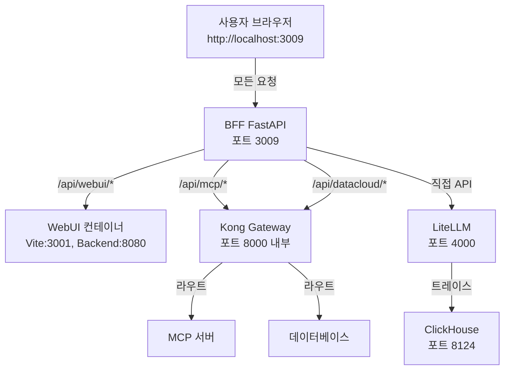

[English](README.md) | 한국어

<p align="center">
  <h1 align="center">Agent Portal</h1>
  <p align="center">
    <strong>엔터프라이즈 에이전틱 AI 플랫폼</strong><br/>
    제로카피 데이터 접근과 완전한 관측성을 갖춘 AI 에이전트의 구축, 배포, 모니터링, 거버넌스
  </p>
</p>

<p align="center">
  <a href="#license"></a>
  <a href="https://github.com/ChangooLee/agent-portal"></a>
  <a href="#contributing"></a>
  
  
</p>

---

## 사용 예시

AI 어시스턴트에게 다음과 같이 요청할 수 있습니다:

- **📊 데이터 분석** — "데이터베이스에서 지난 분기 매출 추이를 보여줘"
- **🔍 기업 공시** — "삼성전자 최신 사업보고서를 가져와줘 (DART)"
- **📈 멀티 LLM 채팅** — "이 질문에 대해 GPT-4o와 Claude-3.5 응답을 비교해줘"
- **⚡ 에이전트 실행** — "Text-to-SQL 에이전트를 실행해서 매출 상위 10개 고객을 찾아줘"

---

## 왜 Agent Portal인가?

> *"2028년까지 엔터프라이즈 소프트웨어 애플리케이션의 33%가 에이전틱 AI를 포함하게 될 것이며, 이는 2024년 1% 미만에서 증가한 수치로, 일상 업무 결정의 15%가 자율적으로 이루어질 수 있게 됩니다."*  
> — [Gartner, 2024](https://www.gartner.com/en/newsroom/press-releases/2024-10-21-gartner-says-agentic-ai-is-the-next-frontier-for-enterprise-automation)

**에이전틱 AI**는 단순 생성형 AI를 넘어 **자율적 의사결정과 작업 수행**이 가능한 차세대 AI 패러다임입니다. 그러나 대부분의 기업은 다음과 같은 도전에 직면합니다:

| 도전 과제 | Agent Portal 솔루션 |
|-----------|----------------------|
| 🔒 레거시 시스템과 AI 연결의 어려움 | **제로카피 데이터 페더레이션** — 기존 DB에 직접 연결, 데이터 이동 없음 |
| 📊 AI 비용과 성능의 불투명성 | **OpenTelemetry 네이티브 관측성** — 모든 호출 추적, 비용 실시간 모니터링 |
| 🔐 AI 거버넌스와 보안 우려 | **엔터프라이즈급 보안** — Kong Gateway, RBAC, 가드레일 |
| 🔧 에이전트 개발/운영 복잡성 | **통합 플랫폼** — 설계-배포-모니터링-관리 통합 환경 |

### 주요 이점

- **🚀 가치 실현 시간 단축**: 기존 데이터 자산을 즉시 AI 에이전트로 활용
- **📈 완전한 가시성**: 모든 AI 활동의 추적성과 감사 가능성 (Auditability)
- **🔌 레거시 친화적 통합**: 기존 시스템 변경 없이 AI 역량 도입
- **🌐 벤더 독립성**: 오픈 스탠다드 기반 (MCP, OpenTelemetry, LiteLLM)

---

## 핵심 기능

Agent Portal은 **Use → Build → Operate** 구조로 AI 에이전트 라이프사이클 전체를 지원합니다.

### 🎯 Use — AI와 상호작용

| 기능 | 설명 |
|------|------|
| **💬 멀티 LLM 채팅** | OpenAI, Anthropic, Azure, Bedrock, Google, Ollama 등 100+ 모델 통합 접근 |
| **🤖 AI 에이전트** | Text-to-SQL, 기업공시분석(DART), 보고서 생성 등 특화 에이전트 |
| **🗃️ Data Cloud** | 기존 데이터베이스에 자연어로 질의 (MariaDB, PostgreSQL, ClickHouse) |
| **🔍 AI 검색** | Perplexica 기반 AI 웹 검색 |
| **📓 AI 노트북** | 대화형 AI 노트북 |
| **📊 보고서** | AI 기반 자동 보고서 생성 |

### 🛠️ Build — 에이전트 개발

| 기능 | 설명 |
|------|------|
| **🧩 에이전트 빌더** | 대화형, 노코드, 코드 기반(LangGraph) 에이전트 생성 |
| **⚡ 워크플로우 빌더** | 비주얼 워크플로우 편집기 |
| **🔗 MCP 통합** | [Model Context Protocol](https://modelcontextprotocol.io/) 서버 관리 — Anthropic 표준 |
| **🗄️ 데이터 연결** | 멀티 데이터베이스 연결 관리 (제로카피) |
| **📚 지식 베이스** | 문서/지식 기반 RAG 구성 |
| **🛡️ 가드레일** | 안전 정책 및 필터 설정 |
| **📝 프롬프트 관리** | 프롬프트 템플릿 버전 관리 |
| **📊 평가** | 모델 평가 및 리더보드 |

### ⚙️ Operate — 운영 및 관리

| 기능 | 설명 |
|------|------|
| **📈 모니터링 대시보드** | 실시간 비용, 지연시간, 에러율, 토큰 사용량 추적 |
| **🔄 트레이스 뷰어** | Agent/LLM 호출 전체 스택 트레이스 |
| **🚪 API 게이트웨이** | Kong 기반 라우팅, 인증, Rate Limiting |
| **👥 사용자 관리** | RBAC 기반 사용자/팀 권한 관리 |
| **⚙️ 시스템 설정** | 플랫폼 설정 중앙 관리 |

---

## 기술적 우수성

### AI 네이티브 아키텍처

Agent Portal은 **AI 네이티브 인프라스트럭처 스택**을 기반으로 설계되었습니다:

```
┌─────────────────────────────────────────────────────────────────┐
│  애플리케이션 레이어     │ 채팅, 에이전트, 보고서, 노트북         │
├──────────────────────────┼──────────────────────────────────────┤
│  에이전트 프레임워크     │ LangGraph, Tool-Use 패턴              │
├──────────────────────────┼──────────────────────────────────────┤
│  LLM 게이트웨이          │ LiteLLM (100+ 모델)                   │
├──────────────────────────┼──────────────────────────────────────┤
│  컨텍스트 프로토콜       │ MCP (Anthropic 표준)                  │
├──────────────────────────┼──────────────────────────────────────┤
│  데이터 페더레이션       │ 제로카피 DB 커넥터                    │
├──────────────────────────┼──────────────────────────────────────┤
│  관측성                  │ OpenTelemetry + ClickHouse           │
├──────────────────────────┼──────────────────────────────────────┤
│  API 게이트웨이          │ Kong (인증, Rate-Limit, 라우팅)       │
├──────────────────────────┼──────────────────────────────────────┤
│  컴퓨트 & 스토리지       │ Docker Compose, MariaDB, Redis       │
└─────────────────────────────────────────────────────────────────┘
```

### 엔터프라이즈급 인프라

| 기능 | 기술 | 이점 |
|------|------|------|
| **LLMOps 관측성** | OpenTelemetry + ClickHouse | 모든 LLM 호출의 트레이스, 비용, 토큰 추적 |
| **AgentOps 모니터링** | 커스텀 대시보드 | 에이전트 실행 흐름, 도구 호출, 에러 분석 |
| **API 보안** | Kong Gateway | Key-Auth, JWT, Rate-Limiting, ACL |
| **데이터 거버넌스** | RBAC + 가드레일 | 역할 기반 접근제어, 안전 정책 |
| **확장성** | Docker Compose + 마이크로서비스 | 서비스별 독립 스케일링 |

### 오픈 스탠다드

Agent Portal은 **벤더 종속 없는 오픈 스탠다드**를 채택합니다:

| 표준 | 채택 | 목적 |
|------|------|------|
| **[Model Context Protocol](https://modelcontextprotocol.io/)** | Anthropic | 에이전트-도구 연결 표준 (stdio, SSE, Streamable HTTP) |
| **[OpenTelemetry](https://opentelemetry.io/)** | CNCF | 분산 트레이싱 표준 |
| **[LiteLLM](https://litellm.vercel.app/)** | MIT OSS | 100+ LLM 통합 게이트웨이 |
| **[Kong Gateway](https://konghq.com/)** | Apache-2.0 | 클라우드 네이티브 API 게이트웨이 |

---

## 아키텍처

**단일 포트 아키텍처 (포트 3009)**

모든 서비스가 단일 포트(3009)를 통해 접근됩니다. BFF(Backend for Frontend)가 메인 엔트리 포인트로 동작합니다.



### 데이터 흐름

| 파이프라인 | 흐름 |
|------------|------|
| **WebUI** | 브라우저 → BFF (3009) → WebUI Backend (8080) |
| **LLM 호출** | 브라우저 → BFF → LiteLLM (4000) → Claude/GPT/등 |
| **모니터링** | LiteLLM → OTEL → ClickHouse → 대시보드 |
| **Text-to-SQL** | 브라우저 → BFF → LangGraph 에이전트 → DB |
| **MCP 게이트웨이** | 브라우저 → BFF → Kong (8000) → MCP 서버 |

---

## 서비스

### 핵심 서비스

| 서비스 | 외부 포트 | 목적 | 헬스 체크 |
|--------|----------|------|-----------|
| **backend** | 3009 | FastAPI BFF (메인 엔트리 포인트) | http://localhost:3009/health |
| **webui** | - | 포털 UI (SvelteKit + Open-WebUI) | BFF 프록시 경유 |
| **litellm** | 4000 | LLM 게이트웨이 (100+ 모델) | http://localhost:4000/health |
| **mariadb** | 3306 | 앱 데이터베이스 | - |
| **clickhouse** | 8124 | 트레이스 저장소 | http://localhost:8124/ping |
| **kong** | 8004 | API 게이트웨이 | http://localhost:8004/status |

### 지원 서비스

| 서비스 | 포트 | 목적 |
|--------|------|------|
| redis | 6379 | 세션/캐시 |
| prometheus | 9090 | 메트릭 수집 |
| chromadb | 8001 | RAG용 벡터 DB |
| minio | 9000/9001 | 오브젝트 스토리지 |
| otel-collector | 4317/4318 | 트레이스 수집 |

---

## 빠른 시작

### 1. 복제 및 설정

```bash
git clone https://github.com/ChangooLee/agent-portal.git
cd agent-portal

cp .env.example .env
# .env 파일에서 API 키 설정 (OPENAI_API_KEY, ANTHROPIC_API_KEY 등)
```

### 2. 서비스 시작

```bash
# 모든 서비스 시작
docker compose up -d

# 헬스 체크 실행
./scripts/health-check.sh

# 또는 자동화된 시작 및 테스트 스크립트 사용
./scripts/start-and-test.sh
```

### 3. 접속

| URL | 설명 |
|-----|------|
| http://localhost:3009 | **포털 UI (메인 엔트리 포인트)** |
| http://localhost:3009/docs | 백엔드 API 문서 |
| http://localhost:4000/ui | LiteLLM 관리 UI |
| http://localhost:1337 | Kong 관리 (Konga) |

---

## Docker 배포

### Docker Compose 사용 (권장)

```bash
# 모든 서비스 시작
docker compose up -d

# 로그 확인
docker compose logs -f

# 모든 서비스 중지
docker compose down
```

### 환경 변수

| 변수 | 설명 | 기본값 |
|------|------|--------|
| `OPENAI_API_KEY` | OpenAI API 키 | - |
| `ANTHROPIC_API_KEY` | Anthropic API 키 | - |
| `LITELLM_MASTER_KEY` | LiteLLM 관리 키 | - |
| `DATABASE_URL` | MariaDB 연결 문자열 | - |

---

## 보안

- **API 키를 절대 공유하지 마세요**
- `.env` 파일을 안전하게 보관하세요
- 적절한 Rate Limiting을 사용하세요
- API 사용량을 모니터링하세요
- 민감한 데이터는 환경 변수에 저장하세요
- 접근 제어를 위해 RBAC을 사용하세요

---

## 문제 해결

### 일반적인 문제

- **인증 실패**:
  - API 키가 유효하고 활성 상태인지 확인
  - API 키에 필요한 권한이 있는지 확인

- **연결 문제**:
  - 인터넷 연결 확인
  - 모든 Docker 컨테이너가 실행 중인지 확인
  - 방화벽이 연결을 차단하지 않는지 확인

### 디버깅 도구

```bash
# 서비스 상태 확인
docker compose ps

# 로그 확인
docker compose logs backend --tail=50 -f

# 포트 충돌 확인
lsof -i :3009

# 헬스 체크
./scripts/health-check.sh
```

---

## 문서

| 문서 | 설명 |
|------|------|
| [AGENTS.md](./AGENTS.md) | AI 에이전트 기술 레퍼런스 |
| [docs/MONITORING_SETUP.md](./docs/MONITORING_SETUP.md) | 모니터링 설정 가이드 |
| [docs/KONGA_SETUP.md](./docs/KONGA_SETUP.md) | Kong Gateway 설정 가이드 |
| [docs/TEXT2SQL_AGENT.md](./docs/TEXT2SQL_AGENT.md) | Text-to-SQL 에이전트 설명서 |
| [docs/TESTING.md](./docs/TESTING.md) | 테스트 가이드 |

---

## 로드맵

### 완료 ✅

- [x] 포털 쉘 (Open-WebUI 기반)
- [x] LLM 게이트웨이 (LiteLLM, 100+ 모델)
- [x] 모니터링 대시보드 (OTEL + ClickHouse)
- [x] Data Cloud (제로카피 DB 커넥터)
- [x] Text-to-SQL 에이전트 (LangGraph)
- [x] MCP 서버 관리
- [x] Kong API 게이트웨이

### 진행 중 🔧

- [ ] 에이전트 빌더 통합 (Langflow, Flowise)
- [ ] RBAC 기반 사용자/팀 권한 관리
- [ ] 프롬프트 템플릿 관리
- [ ] 에이전트 마켓플레이스

### 계획됨 📋

#### 핵심 플랫폼 개선
- [ ] **Agent-to-UI 테스트 자동화**: Playwright + OTEL 기반 UI 테스트 및 관측
- [ ] **모델 자동 라우팅**: OpenRouter 메타데이터 기반 최적 모델 선택
- [ ] **고급 Tool-Use 패턴**: LangGraph Plan→Execute→Validate→Retry 루프
- [ ] **Data Cloud 시멘틱 레이어**: 엔터티/지표 표준화 및 RAG 통합

#### 인프라 및 운영
- [ ] **AI 네이티브 스택 매핑**: 기술 레이어 ↔ 코드 매핑 자동화
- [ ] **MCP 자동 유지보수**: 스펙 준수 체크 및 자동 테스트
- [ ] **보안 강화**: OPA 정책 엔진, ABAC, 감사 추적

#### 에이전트 기능
- [ ] **고위험 도메인 에이전트**: 법률/의료/투자 안전장치
- [ ] **비용 인지형 에이전트**: 예산 정책 기반 최적화
- [ ] **에이전트 빌더 강화**: 노드 기반 플로우 편집기
- [ ] **메모리 관리 강화**: 세션/장기 메모리, TTL, 권한

> 상세 구현 가이드: [AGENTS.md#14-future-development-epics](./AGENTS.md#14-future-development-epics)

---

## 개발

### 로컬 개발

```bash
# 백엔드 (핫 리로드)
cd backend
pip install -r requirements.txt
uvicorn app.main:app --reload --host 0.0.0.0 --port 3009

# 프론트엔드 (핫 리로드)
cd webui
npm install && npm run dev
```

### 테스트

```bash
./scripts/start-and-test.sh      # 자동화된 시작 및 테스트
./scripts/regression-test.sh     # 회귀 테스트
./scripts/verify-network-paths.sh # 네트워크 경로 검증
```

### 서비스 재빌드

```bash
# 단일 서비스
docker compose build --no-cache backend
docker compose up -d backend

# 전체 재빌드
docker compose down
docker compose build --no-cache
docker compose up -d
```

---

## 기여하기

기여를 환영합니다! Agent Portal은 **오픈소스**이며, 모든 기여를 환영합니다.

### 기여 방법

1. 저장소를 **포크**하세요
2. 기능 브랜치를 만드세요 (`git checkout -b feature/amazing-feature`)
3. 변경사항을 커밋하세요 (`git commit -m 'Add amazing feature'`)
4. 브랜치에 푸시하세요 (`git push origin feature/amazing-feature`)
5. **Pull Request**를 열어주세요

### Good First Issues

- 문서 개선
- UI/UX 향상
- 추가 데이터베이스 커넥터 지원
- 모니터링 대시보드 위젯

### 개발 참조

- [AGENTS.md](./AGENTS.md) — 기술 레퍼런스
- [.cursorrules](./.cursorrules) — 개발 가이드라인

---

## 라이선스

이 프로젝트는 **비상업적, 개인적, 연구, 학습 목적에 한해** 라이선스가 부여됩니다. 상업적 사용, 재배포, 2차 저작물의 상업적 이용은 엄격히 금지됩니다. 자세한 내용은 [LICENSE](LICENSE) 파일을 참조하세요.

| 컴포넌트 | 라이선스 |
|----------|----------|
| Open-WebUI (포털 쉘) | AGPL-3.0 |
| LiteLLM | MIT |
| Kong Gateway (OSS) | Apache-2.0 |
| ClickHouse | Apache-2.0 |
| **Agent Portal 코드** | Non-Commercial Personal Use Only |

---

<p align="center">
  <strong>Agent Portal</strong> — 엔터프라이즈 에이전틱 AI 플랫폼<br/>
  AI 네이티브 미래를 위해 ❤️로 만들었습니다
</p>

**최종 업데이트**: 2025-12-23

