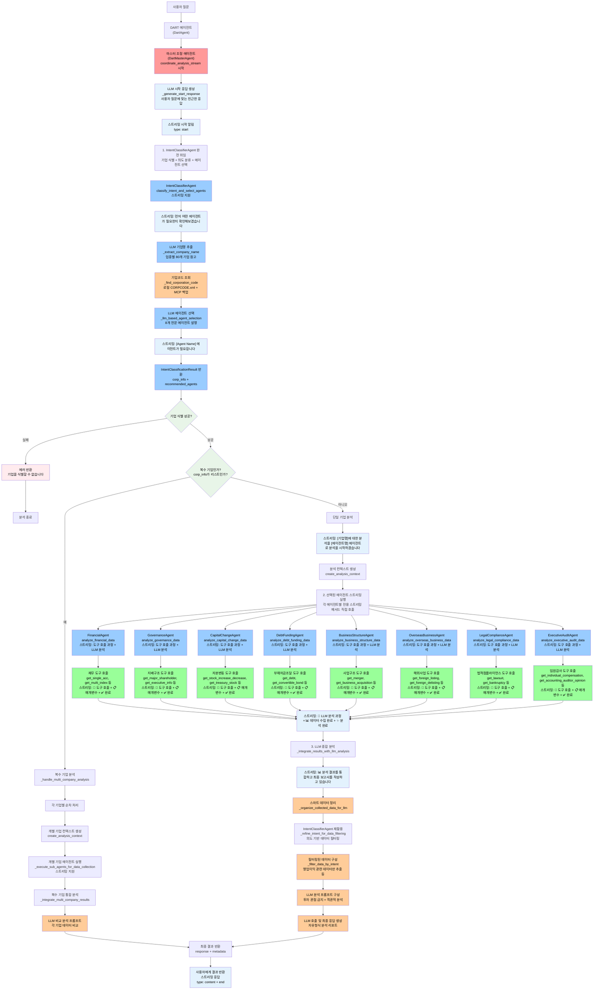

# DART 멀티에이전트 시스템

## 🎯 개요

DART 공시 데이터 분석을 위한 고도화된 멀티에이전트 시스템입니다.
단일 에이전트의 한계를 극복하고, 81개 DART 도구를 전문 영역별로 분산하여 심층적이고 체계적인 리스크 분석을 제공합니다.

## 🚀 주요 개선사항 (2025년 10월 업데이트)

### **StateGraph Memory System 구축**
- **멀티턴 대화 지원**: StateGraph + Checkpointer를 활용한 대화 맥락 유지
- **단기/장기 메모리 분리**: Checkpointer(단기) + Store API(장기) 구조
- **프롬프트 오염 방지**: SystemMessage 고정으로 프롬프트 일관성 확보
- **메모리 API 엔드포인트**: 사용자/대화 메모리 조회/삭제 기능
- **LLMManager**: 목적별 LLM 관리 (향후 다중 LLM 전환 준비)

### **하이브리드 아키텍처**
- **DartAgent/MasterAgent**: StateGraph (멀티턴 대화 + 메모리 관리)
- **전문 에이전트**: BaseAgent (create_agent, 단일 분석 작업)
- **효율적 분산**: 복잡도 감소 및 성능 최적화

## 🚀 주요 개선사항 (2025년 9월 업데이트)

### **공통 프롬프트 시스템 도입**
- **PromptBuilder 클래스**: 8개 서브 에이전트의 시스템 프롬프트를 공통화
- **BasePromptTemplate**: 핵심 원칙, 기업 정보, 경고, 작업 지시사항 등 공통 부분 통합
- **DomainSpecificTemplates**: 각 에이전트별 특화된 분석 요청 및 도구 설명 제공
- **도구별 프롬프트 파일**: 각 에이전트의 도구 설명을 별도 파일로 분리하여 관리
- **코드 중복 제거**: `_create_analysis_prompt` 메서드가 10줄 이내로 단순화

### **무한 루프 방지 강화**
- **명시적 경고 섹션**: "❌ 절대 금지" 항목으로 무한 재호출 방지 강조
- **도구 호출 제한**: 각 에이전트별 `max_tool_calls` 설정으로 하드 리미트 적용
- **체크리스트 제공**: 호출 전 중복 여부 확인 가이드라인 제공
- **중복 호출 방지**: 여러 도구를 묶음으로 호출하더라도 같은 파라미터로 반복호출하지 않도록 명시

### **도구 임시 저장부 제거**
- **adaptive_ingest.py 삭제**: 대용량 데이터 세그먼트 저장 기능 제거
- **단순화된 구조**: 기본 도구들만 사용하여 안정성 향상
- **메모리 효율성**: 복잡한 세그먼트 저장 로직 제거로 메모리 사용량 최적화

### **IntentClassifierAgent 개선**
- **도구명 정확성 향상**: overseas_business, legal_compliance, executive_audit 도구명을 실제 MCP 도구명과 일치하도록 수정
- **공시-질문 연계 분석**: 최근 공시 정보와 사용자 질문을 연결하여 분석하도록 프롬프트 개선
- **LLM 기반 판단**: 키워드 기반 판단에서 LLM 자율 판단으로 전환
- **의미 기반 선택**: 기계적 매칭이 아닌 의미 기반 에이전트 선택 강조
- **공시 데이터 필드명 수정**: report_nm, rcept_dt 등 올바른 DART API 필드명 사용

### **데이터 변환 개선 (dart_transformer.py)**
- **타법인 출자현황 개선**: incrs_dcrs_evl_lstmn 필드를 사용한 정확한 평가손익 계산
- **동적 그룹핑**: 하드코딩 없이 quartile 기반 동적 그룹 생성
- **통계 정확성**: 단위 변환 및 데이터 검증 강화
- **AI 친화적 출력**: 구조화된 통계 데이터를 LLM이 이해하기 쉬운 형태로 제공

## 🏗️ 시스템 아키텍처

### **하이브리드 아키텍처 (2025년 10월)**

```
📱 사용자 요청
    ↓
🌐 API Gateway (FastAPI)
    ↓
🧠 DartAgent (StateGraph) — 멀티턴 대화 + 메모리 관리
    ├── 📊 DartMasterAgent (StateGraph) — 전체 워크플로우 조정
    ├── 🎯 IntentClassifierAgent (StateGraph) — 질문 분석 및 에이전트 선택
    └── 🔧 전문 에이전트들 (BaseAgent) — 단일 분석 작업
        ├── 💰 FinancialAgent — 재무 리스크 분석
        ├── 🏛️ GovernanceAgent — 지배구조 리스크 분석
        ├── 📈 CapitalChangeAgent — 자본변동 분석
        ├── 💳 DebtFundingAgent — 부채/자금조달 분석
        ├── 🏢 BusinessStructureAgent — 사업구조 분석
        ├── 🌍 OverseasBusinessAgent — 해외사업 분석
        ├── ⚖️ LegalComplianceAgent — 법적리스크 분석
        ├── 👥 ExecutiveAuditAgent — 경영진감사 분석
        └── 📄 DocumentAnalysisAgent — 문서 기반 심층 분석
```

### **메모리 시스템**

```
🧠 메모리 관리
├── 📝 단기 메모리 (Checkpointer)
│   ├── 대화 히스토리
│   ├── 도구 호출 기록
│   └── 에이전트 상태
└── 💾 장기 메모리 (Store API)
    ├── 사용자 프로필
    ├── 분석 패턴
    └── 세션 메타데이터
```

### **기존 아키텍처 (2025년 9월)**

```
DartAgent (메인 인터페이스)
├── 마스터 조정 에이전트(DartMasterAgent) — 전체 워크플로우 조정
├── 의도 분류 에이전트(IntentClassifierAgent) — 질문 분석 및 에이전트 선택
├── 재무 분석 에이전트(FinancialAgent) — 재무 리스크 분석
├── 지배구조 분석 에이전트(GovernanceAgent) — 지배구조 리스크 분석
├── 자본변동 분석 에이전트(CapitalChangeAgent) — 자본변동 분석
├── 부채자금조달 분석 에이전트(DebtFundingAgent) — 부채/자금조달 분석
├── 사업구조 분석 에이전트(BusinessStructureAgent) — 사업구조 분석
├── 해외사업 분석 에이전트(OverseasBusinessAgent) — 해외사업 분석
├── 법적컴플라이언스 분석 에이전트(LegalComplianceAgent) — 법적/규제 리스크 분석
└── 임원감사 분석 에이전트(ExecutiveAuditAgent) — 경영진/감사 분석
```

## 🔄 멀티에이전트 분석 흐름 (스트리밍 통합)



## 🎭 에이전트별 역할

### 1. **DART 에이전트(DartAgent)**
- 기존 API 호환성 유지
- 멀티에이전트 시스템 초기화 및 관리
- 단일/멀티 모드 실행 지원

### 2. **마스터 조정 에이전트(DartMasterAgent)**
- 전체 워크플로우 관리 및 조정
- 의도 분류 에이전트(IntentClassifierAgent)가 분류한 결과 기반으로 하위 에이전트 실행
- 최종 결과 통합 및 리포트 생성
- **주요 도구**: `get_corporation_code_by_name`, `get_corporation_info`, `get_disclosure_list`

### 3. **의도 분류 에이전트(IntentClassifierAgent)**
- 사용자 질문 의도 분석 (scope/domain/depth)
- 필요 전문 에이전트 조합 결정
- 복합질의는 CoT로 분해 후 라우팅
- 기업 코드 조회 및 기업 정보 수집

### 4. **재무 분석 에이전트(FinancialAgent)**
- **전문 분야**: 재무 건전성, 수익성, 유동성, 재무제표 분석
- **도구 (8개)**: 
  - 기초 조회: `get_corporation_code_by_name`, `get_corporation_info`, `get_disclosure_list`
  - 재무제표: `get_single_acnt`, `get_multi_acnt`, `get_single_acc`
  - 재무지표: `get_single_index`, `get_multi_index`
- **분석**: 재무제표 추이, 주요 재무비율, 수익성/안정성/성장성/활동성 지표

### 5. **지배구조 분석 에이전트(GovernanceAgent)**
- **전문 분야**: 주주구성, 임원현황, 지배구조, 소유구조
- **도구 (8개)**: 
  - 주주구조: `get_major_shareholder`, `get_major_shareholder_changes`, `get_minority_shareholder`, `get_major_holder_changes`
  - 임원관리: `get_executive_trading`, `get_executive_info`, `get_employee_info`, `get_outside_director_status`
- **분석**: 최대주주 변동, 임원/사외이사 구조, 지분구조 리스크, 소액주주 보호

### 6. **자본변동 분석 에이전트(CapitalChangeAgent)**
- **전문 분야**: 자본변동, 증자/감자, 자기주식 관리
- **도구 (11개)**: 
  - 주식변동: `get_stock_increase_decrease`, `get_stock_total`, `get_treasury_stock`
  - 자기주식: `get_treasury_stock_acquisition`, `get_treasury_stock_disposal`, `get_treasury_stock_trust_contract`, `get_treasury_stock_trust_termination`
  - 증감자: `get_paid_in_capital_increase`, `get_free_capital_increase`, `get_paid_free_capital_increase`, `get_capital_reduction`
- **분석**: 발행주식 수 변동, 자본 변동 요인, 자기주식 정책

### 7. **부채자금조달 분석 에이전트(DebtFundingAgent)**
- **전문 분야**: 채권발행, 사채, 자금조달 구조
- **도구 (15개)**: 
  - 채무증권 발행 (6개): `get_debt`, `get_debt_securities_issued`, `get_convertible_bond`, `get_bond_with_warrant`, `get_exchangeable_bond`, `get_write_down_bond`
  - 미상환 잔액 (5개): `get_commercial_paper_outstanding`, `get_short_term_bond_outstanding`, `get_corporate_bond_outstanding`, `get_hybrid_securities_outstanding`, `get_conditional_capital_securities_outstanding`
  - 자금 사용 및 지분증권 (4개): `get_public_capital_usage`, `get_private_capital_usage`, `get_equity`, `get_depository_receipt`
- **분석**: CB/BW/EB 발행 현황, 미상환 잔액, 자금조달 리스크

### 8. **사업구조 분석 에이전트(BusinessStructureAgent)**
- **전문 분야**: M&A, 분할/합병, 자산양수도, 사업구조 변화
- **도구 (17개)**: 
  - 사업양수도: `get_business_acquisition`, `get_business_transfer`
  - 합병분할: `get_merger`, `get_division`, `get_division_merger`, `get_stock_exchange`
  - 증권신고서: `get_merger_report`, `get_stock_exchange_report`, `get_division_report`
  - 자산거래: `get_other_corp_stock_acquisition`, `get_other_corp_stock_transfer`, `get_stock_related_bond_acquisition`, `get_stock_related_bond_transfer`, `get_tangible_asset_acquisition`, `get_tangible_asset_transfer`, `get_asset_transfer`, `get_investment_in_other_corp`
- **분석**: 사업 재편, 인수합병 리스크, 자산 구조조정

### 9. **해외사업 분석 에이전트(OverseasBusinessAgent)**
- **전문 분야**: 해외 증권시장 상장/상장폐지
- **도구 (4개)**: 
  - 해외상장: `get_foreign_listing_decision`, `get_foreign_delisting_decision`, `get_foreign_listing`, `get_foreign_delisting`
- **분석**: 해외 진출/철수 리스크, 글로벌 확장 전략

### 10. **법적컴플라이언스 분석 에이전트(LegalComplianceAgent)**
- **전문 분야**: 경영위기, 법적위험, 소송, 회생절차
- **도구 (7개)**: 
  - 경영위기: `get_bankruptcy`, `get_business_suspension`, `get_rehabilitation`, `get_dissolution`
  - 채권관리: `get_creditor_management`, `get_creditor_management_termination`
  - 법적분쟁: `get_lawsuit`
- **분석**: 법적 분쟁, 규제 리스크, 부도/파산 위험, 회생절차

### 11. **임원감사 분석 에이전트(ExecutiveAuditAgent)**
- **전문 분야**: 임원 보수, 감사계약, 회계감사
- **도구 (9개)**: 
  - 임원보수: `get_individual_compensation`, `get_total_compensation`, `get_individual_compensation_amount`, `get_unregistered_exec_compensation`, `get_executive_compensation_approved`, `get_executive_compensation_by_type`
  - 감사관련: `get_accounting_auditor_opinion`, `get_audit_service_contract`, `get_non_audit_service_contract`
- **분석**: 보수 한도, 고액보수자 현황, 감사의견 적정성, 감사계약 투명성

## 🧠 IntentClassifierAgent 상세 흐름

```mermaid
graph TD
    A[사용자 질문 입력] --> B[classify_intent_and_select_agents 시작]
    
    B --> C[1단계: LLM 기업명 추출<br/>_extract_company_name<br/>업종별 대표기업 80개 참고]
    C --> C1{기업명 추출 성공?<br/>길이 >= 2}
    C1 -->|실패| C2[_get_default_classification_with_error<br/>에러 메시지와 함께 종료]
    C1 -->|성공| D[기업명 문자열 획득<br/>쉼표로 분리하여 리스트 생성]
    
    D --> F{복수 기업인가?<br/>len > 1}
    
    F -->|예| G[복수 기업 처리 시작<br/>corp_info_list = []]
    G --> G1[각 기업별 순회 처리]
    G1 --> G2[_find_corporation_code 호출]
    G2 --> G3[로컬 CORPCODE.xml 검색<br/>_search_local_corpcode]
    G3 --> G4{로컬에서 발견?}
    G4 -->|예| G5[로컬 결과 사용]
    G4 -->|아니오| G6[MCP 도구 호출<br/>get_corporation_code_by_name]
    G5 --> G7[_extract_corp_code_from_result<br/>기업코드 추출]
    G6 --> G7
    G7 --> G8{기업코드 추출 성공?}
    G8 -->|예| G9[기업 정보 구성 후<br/>corp_info_list에 추가]
    G8 -->|아니오| G10[WARNING 로그 후 다음 기업]
    G9 --> G11{모든 기업 처리 완료?}
    G10 --> G11
    G11 -->|아니오| G1
    G11 -->|예| G12{corp_info_list 비어있음?}
    G12 -->|예| G13[_get_default_classification_with_error<br/>모든 기업 조회 실패]
    G12 -->|아니오| G14[_classify_standard 호출<br/>첫 번째 기업 기준]
    
    F -->|아니오| H[단일 기업 처리]
    H --> H1[_find_corporation_code 호출]
    H1 --> H2[로컬 CORPCODE.xml 검색<br/>_search_local_corpcode]
    H2 --> H3{로컬에서 발견?}
    H3 -->|예| H4[로컬 결과 사용]
    H3 -->|아니오| H5[MCP 도구 호출<br/>get_corporation_code_by_name]
    H4 --> H6[_extract_corp_code_from_result<br/>기업코드 추출]
    H5 --> H6
    H6 --> H7{기업코드 추출 성공?}
    H7 -->|아니오| H8[_get_default_classification_with_error<br/>기업코드 추출 실패]
    H7 -->|예| H9[기업 정보 구성<br/>verified_corp_info]
    H9 --> H10[_classify_standard 호출]
    
    G14 --> I[_llm_based_agent_selection 호출]
    H10 --> I
    
    I --> I1[LLM 에이전트 선택 프롬프트<br/>8개 전문 에이전트 설명<br/>JSON 형식 요청]
    I1 --> I2[agent_executor.ainvoke<br/>LLM 호출]
    I2 --> I3{LLM 응답 성공?}
    I3 -->|실패| I4[_get_fallback_agent_selection<br/>기본 에이전트 사용]
    I3 -->|성공| I5[JSON 파싱 시도]
    I5 --> I6{JSON 파싱 성공?}
    I6 -->|실패| I4
    I6 -->|성공| I7[Enum 변환<br/>scope, domain, depth]
    
    I4 --> J[IntentClassificationResult 생성]
    I7 --> J
    G14 --> J1[복수 기업 결과 처리<br/>scope = MULTI_COMPANY<br/>corp_info = list]
    J1 --> J
    
    J --> K[최종 결과 반환<br/>required_agents, priority_order 포함]
    
    C2 --> END[에러 종료]
    G13 --> END
    H8 --> END
    
    style C fill:#e1f5fe,color:#000
    style I fill:#e8f5e8,color:#000
    style G3 fill:#fff3e0,color:#000
    style H2 fill:#fff3e0,color:#000
    style C2 fill:#ffebee,color:#000
    style G13 fill:#ffebee,color:#000
    style H8 fill:#ffebee,color:#000
```

## 📋 IntentClassifierAgent 구체적 프로세스 설명

### 🔍 **1단계: LLM 기업명 추출** (`_extract_company_name`)
- **입력**: 사용자 질문 (예: "국내 3대 생보사의 영업이익을 비교해줘")
- **처리**: 
  - 업종별 대표기업 80개 참고 (생명보험 10개, 손해보험 10개, 증권 10개, 신용카드 10개 등)
  - LLM에게 강제 응답 요구: "절대 '없음'이라고 답하지 마세요"
  - 맥락 기반 추론: 목록에 없어도 적절한 기업명 추론 가능
- **출력**: "한화생명,교보생명,동양생명" (쉼표 구분)
- **실패 시**: `_get_default_classification_with_error` 호출하여 즉시 종료

### 🏢 **2단계: 기업코드 조회** (`_find_corporation_code`)
- **로컬 우선**: `CORPCODE.xml`에서 exact/contains/similarity 매칭
- **MCP 백업**: 로컬 실패 시 `get_corporation_code_by_name` 도구 호출
- **코드 추출**: `_extract_corp_code_from_result`로 JSON 파싱 및 기업코드 추출
- **검증**: 기업코드 존재 여부 확인

### 🔀 **3단계: 단일/복수 기업 분기**
#### **복수 기업 처리** (len > 1):
- 각 기업별 순회하여 기업코드 조회
- 성공한 기업만 `corp_info_list`에 추가
- 실패한 기업은 WARNING 로그 후 계속 진행
- 모든 기업 실패 시 에러 반환
- 첫 번째 기업 기준으로 `_classify_standard` 호출
- `scope = MULTI_COMPANY`, `corp_info = list` 설정

#### **단일 기업 처리**:
- 기업코드 조회 실패 시 즉시 에러 반환
- 성공 시 `verified_corp_info` 구성
- `_classify_standard` 호출

### 🤖 **4단계: LLM 기반 에이전트 선택** (`_llm_based_agent_selection`)
- **프롬프트 구성**: 8개 전문 에이전트별 상세 설명 (역할, 도구, 사용시기)
- **LLM 호출**: `agent_executor.ainvoke`로 JSON 형식 응답 요청
- **JSON 파싱**: 정규식으로 JSON 추출 후 파싱
- **Enum 변환**: scope, domain, depth를 해당 Enum으로 변환
- **실패 처리**: `_get_fallback_agent_selection`으로 기본 에이전트 사용

### 📊 **5단계: 결과 생성** (`IntentClassificationResult`)
- **필수 필드**: required_agents, priority_order, confidence, reasoning
- **복수 기업**: corp_info를 리스트로 설정, scope를 MULTI_COMPANY로 강제 변경
- **단일 기업**: corp_info를 단일 객체로 설정

### ⚠️ **에러 처리 전략**
1. **조기 종료**: LLM 기업명 추출 실패 시 즉시 에러 반환
2. **부분 성공**: 복수 기업 중 일부 실패는 허용, 성공한 기업만 처리
3. **기본값 제공**: LLM 에이전트 선택 실패 시 기본 에이전트 사용
4. **상세 로깅**: 각 단계별 SUCCESS/WARNING/ERROR 로그 기록

## 🧠 의도 분류 체계

### 분류 기준
- **범위**: 단일기업 / 복수기업 / 업종분석 / 종합리스크
- **영역**: 재무분석(financial) / 지배구조(governance) / 자본변동(capital_change) / 부채자금조달(debt_funding) / 사업구조(business_structure) / 해외사업(overseas_business) / 법적컴플라이언스(legal_risk) / 임원감사(executive_audit)
- **깊이**: 기본(basic) / 중급(intermediate) / 고급(advanced)

### 분석 흐름 예시
```
"현대자동차의 부채비율이 위험한가?"
→ 단일기업 + 재무분석(financial) + 중급(intermediate) → 재무 분석 에이전트(FinancialAgent)

"현대차그룹 지배구조 리스크 분석해줘"
→ 단일기업 + 지배구조(governance) + 고급(advanced) → 지배구조 분석 에이전트(GovernanceAgent)

"HD현대중공업의 2024년 재무지표 분석"
→ 단일기업 + 재무분석(financial) + 중급(intermediate) → 재무 분석 에이전트(FinancialAgent)
```

## 🔧 핵심 특징

### 실시간 스트리밍 통합 시스템
- **전체 워크플로우 스트리밍**: 사용자 질문부터 최종 결과까지 실시간 진행 상황 표시
- **LLM 기반 시작 응답**: 사용자 질문에 맞는 친근하고 간결한 시작 메시지
- **에이전트별 전용 스트리밍**: 각 에이전트의 도구 호출 과정과 LLM 분석 과정 실시간 표시
- **도구 호출 가시성**: 🔧 도구 호출, 📋 매개변수, ✅ 완료 상태를 사용자 친화적으로 표시
- **LLM 사고 과정 표시**: 💭 LLM의 분석 과정과 도구 선택 이유를 실시간으로 공개
- **통합 스트리밍 아키텍처**: DartMasterAgent가 모든 에이전트의 스트리밍을 통합하여 사용자에게 전달

### 전문 영역별 분산 처리
- **81개 DART 도구**를 8개 전문 에이전트로 분산
  - 재무 분석 에이전트(FinancialAgent): 8개
  - 지배구조 분석 에이전트(GovernanceAgent): 8개  
  - 자본변동 분석 에이전트(CapitalChangeAgent): 11개
  - 부채자금조달 분석 에이전트(DebtFundingAgent): 15개
  - 사업구조 분석 에이전트(BusinessStructureAgent): 17개
  - 해외사업 분석 에이전트(OverseasBusinessAgent): 4개
  - 법적컴플라이언스 분석 에이전트(LegalComplianceAgent): 7개
  - 임원감사 분석 에이전트(ExecutiveAuditAgent): 9개
- 각 에이전트는 **특정 리스크 영역**에 특화된 도구 조합 보유
- **순차 처리**: 스트리밍 지원을 위해 에이전트별 순차 실행으로 변경

### 지능형 의도 분류 및 에이전트 선택
- **3차원 분류**: 범위(scope) × 영역(domain) × 깊이(depth)
- **CoT 기반 분해**: 복합 질의를 단위 작업으로 분해
- **동적 에이전트 조합**: 질문에 따라 최적 에이전트 선택
- **LLM 기반 판단**: 공시 분석과 질문 내용을 종합하여 에이전트 선택
- **스트리밍 의도 분류**: "먼저 어떤 에이전트가 필요한지 확인해보겠습니다" → "[Agent Name] 에이전트가 필요합니다"

### 공통 프롬프트 시스템
- **PromptBuilder 클래스**: 8개 서브 에이전트의 시스템 프롬프트를 통합 관리
- **BasePromptTemplate**: 핵심 원칙, 기업 정보, 경고, 작업 지시사항 등 공통 부분 제공
- **DomainSpecificTemplates**: 각 에이전트별 특화된 분석 요청 및 도구 설명 제공
- **도구별 프롬프트 파일**: 각 에이전트의 도구 설명을 별도 파일로 분리하여 관리
  - `financial_tools.py`, `governance_tools.py`, `capital_change_tools.py` 등
- **코드 중복 제거**: `_create_analysis_prompt` 메서드가 10줄 이내로 단순화
- **유지보수성 향상**: 프롬프트 수정 시 한 곳에서만 변경하면 모든 에이전트에 적용

### 품질 보장 체계
- **실제 도구 호출 검증**: 로그로 MCP 도구 실행 확인
- **데이터 수집 결과 검증**: 0개 레코드는 실패로 처리
- **투자 관점 완전 차단**: 객관적 재무 분석에 집중
- **무한 루프 방지**: 명시적 경고 섹션과 도구 호출 제한으로 무한 재호출 방지
- **재호출 허용**: 데이터가 이상하거나 불완전하면 도구 재호출
- **Langfuse 통합 로깅**: 에이전트별 성과 및 시스템 안정성 모니터링
- **실시간 오류 처리**: 스트리밍 중 발생하는 오류를 즉시 사용자에게 알림

## 📊 성능 최적화

### 스트리밍 최적화 아키텍처
- **실시간 진행 상황 표시**: 사용자가 분석 과정을 실시간으로 모니터링 가능
- **비동기 스트리밍 처리**: 각 에이전트의 스트리밍 메서드를 비동기로 처리
- **순차 실행**: 스트리밍 지원을 위해 에이전트별 순차 실행으로 변경 (병렬 → 순차)
- **재시도 메커니즘**: 스트리밍 중 오류 발생 시 적절한 에러 메시지 표시

### 데이터 최적화
- **응답 데이터 압축**: `optimize_financial_response` 함수로 재무 데이터 크기 최적화
- **중복 데이터 요청 최소화**: 기업 코드 조회 결과 재활용
- **메모리 효율적 데이터 처리**: adaptive_ingest.py 제거로 메모리 사용량 최적화
- **점진적 결과 반환**: 스트리밍을 통한 사용자 경험 대폭 개선
- **실시간 데이터 표시**: 도구 호출 과정과 LLM 분석 과정을 실시간으로 표시
- **단순화된 구조**: 복잡한 세그먼트 저장 로직 제거로 안정성 향상

### 멀티에이전트 조정 최적화
- **마스터 조정 에이전트**가 전체 워크플로우와 스트리밍을 효율적 관리
- **의도 분류 에이전트**의 선제적 기업 정보 수집 및 스트리밍 지원
- **전문 에이전트별** 도구 특화로 처리 속도 향상
- **공통 프롬프트 시스템**으로 코드 중복 제거 및 유지보수성 향상
- **LLM 기반 종합 분석**으로 최종 결과 품질 보장
- **통합 스트리밍**: 모든 에이전트의 스트리밍을 DartMasterAgent에서 통합 관리
- **무한 루프 방지**: 하드 리미트와 명시적 경고로 안정성 확보

## 🔍 상세 분석 흐름 (스트리밍 통합 구현 기준)

### 1단계: 사용자 질문 접수 및 스트리밍 시작
- **DART 에이전트(DartAgent)**: 사용자 요청 수신 및 멀티에이전트 모드 확인
- **마스터 조정 에이전트(DartMasterAgent)**: `coordinate_analysis_stream` 메서드로 스트리밍 워크플로우 시작
- **LLM 시작 응답**: `_generate_start_response`로 사용자 질문에 맞는 친근한 시작 메시지 생성
- **스트리밍 시작**: `type: start`로 시작 알림 전달

### 2단계: IntentClassifierAgent 스트리밍 처리
- **스트리밍 의도 분류**: "먼저 어떤 에이전트가 필요한지 확인해보겠습니다" 메시지 전달
- **기업명 추출**: `_extract_company_name`으로 LLM 기반 기업명 추출 (업종별 80개 기업 참고)
- **기업코드 조회**: `_find_corporation_code`로 로컬 CORPCODE.xml 우선 + MCP 백업
- **에이전트 선택**: `_llm_based_agent_selection`으로 8개 전문 에이전트 중 최적 조합 선택
- **스트리밍 완료**: "[Agent Name] 에이전트가 필요합니다" 메시지 전달
- **결과 반환**: `IntentClassificationResult` (corp_info + recommended_agents)

### 3단계: 단일/복수 기업 분기 처리
#### **복수 기업 분석** (`_handle_multi_company_analysis`):
- 각 기업별 순차 처리로 개별 컨텍스트 생성
- 개별 기업별 에이전트 실행 후 결과 수집 (스트리밍 지원)
- `_integrate_multi_company_results`로 LLM 비교 분석

#### **단일 기업 분석**:
- **스트리밍 시작**: "[기업명]에 대한 분석을 [에이전트명] 에이전트로 분석을 시작하겠습니다" 메시지 전달
- **분석 컨텍스트 생성**: `create_analysis_context`로 분석 환경 구성

### 4단계: 전문 에이전트 스트리밍 실행
- **순차 스트리밍 처리**: `_execute_sub_agents_for_data_collection`로 선택된 에이전트들을 순차 실행
- **에이전트별 전용 스트리밍**: 각 에이전트의 `analyze_[domain]_data` 메서드 직접 호출
- **실시간 도구 호출 표시**: 🔧 도구 호출, 📋 매개변수, ✅ 완료 상태를 사용자 친화적으로 표시
- **LLM 사고 과정 표시**: 💭 LLM의 분석 과정과 도구 선택 이유를 실시간으로 공개
- **결과 수집**: `AgentResult` 리스트로 원본 데이터 반환

### 5단계: LLM 기반 종합 분석 (`_integrate_results_with_llm_analysis`)
- **스트리밍 통합 알림**: "📊 분석 결과를 통합하고 최종 보고서를 작성하고 있습니다" 메시지 전달
#### **스마트 데이터 정리** (`_organize_collected_data_for_llm`):
- **의도 재분석**: IntentClassifierAgent 재활용으로 데이터 필터링 의도 파악
- **데이터 필터링**: `_filter_data_by_intent`로 의도별 핵심 데이터만 추출
- **압축 구성**: 영업이익 관련 데이터만 추출 등 맞춤형 필터링

#### **LLM 분석**:
- **프롬프트 구성**: 투자 관점 금지 + 객관적 분석 + 한자 사용 금지
- **LLM 호출**: 수집된 데이터 기반 자유형식 분석 리포트 생성
- **메타데이터 포함**: tools_used, agents_involved, analysis_timestamp 등

### 6단계: 최종 스트리밍 응답 생성 및 반환
- **통합 결과**: response + metadata 형태로 최종 결과 구성
- **스트리밍 최종 응답**: `type: content`로 최종 분석 결과 전달
- **완료 알림**: `type: end`로 분석 완료 및 소요시간 표시
- **성능 로깅**: Langfuse 통합 로깅으로 에이전트별 성과 추적
- **실시간 오류 처리**: 스트리밍 중 발생하는 오류를 즉시 사용자에게 알림

