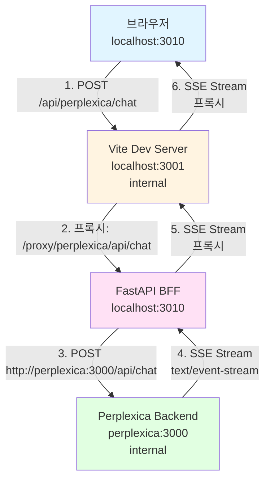
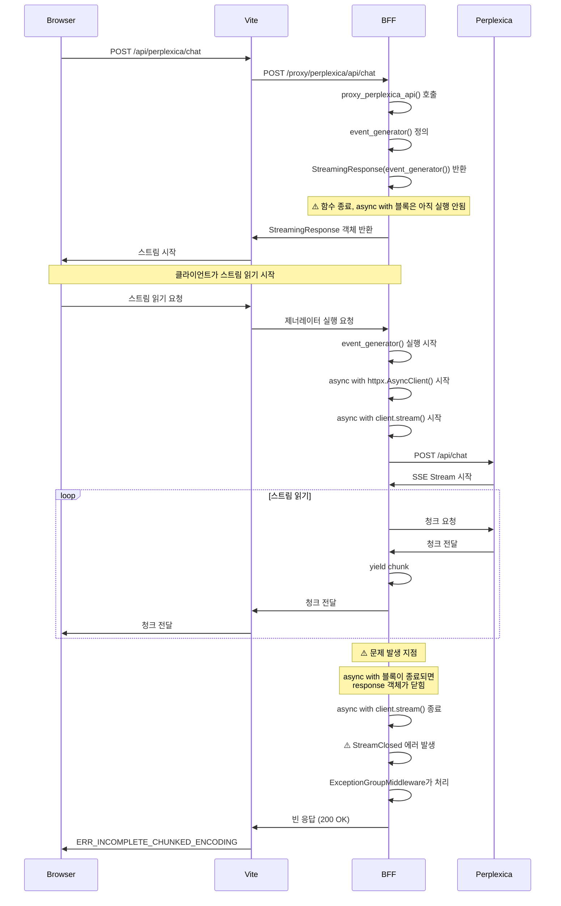

# Perplexica 스트리밍 문제 상세 분석

> **작성일**: 2026-01-06  
> **버전**: 2.0  
> **상태**: aiohttp 전환 완료, JSON 파싱 에러 분석 중

---

## 1. 문제 개요

### 1.1 발생하는 에러

#### 해결된 에러 (httpx → aiohttp 전환)
```
httpx.StreamClosed: Attempted to read or stream content, but the stream has been closed.
```

**상태**: ✅ **해결됨** (aiohttp로 전환)  
**이전 발생 위치**: `backend/app/routes/proxy.py`의 `event_generator()` 내부  
**해결 방법**: httpx 대신 aiohttp 사용

#### 현재 발생하는 에러 (Perplexica 백엔드)
```
SyntaxError: Unterminated string in JSON at position 1033 (line 1 column 1034)
SyntaxError: Unexpected end of JSON input
SyntaxError: Bad Unicode escape in JSON at position 979 (line 1 column 980)
SyntaxError: Expected ',' or ']' after array element in JSON at position 952 (line 1 column 953)
```

**발생 위치**: `perplexica/src/app/api/chat/route.ts`의 `req.json()` 호출 중  
**발생 시점**: Next.js의 `req.json()`이 요청 본문을 파싱할 때  
**에러 처리**: Perplexica 백엔드에서 500 에러 반환, 프론트엔드에서 "검색할 내용을 입력하세요" 메시지 표시

**에러 특징**:
- 다양한 JSON 파싱 에러가 반복적으로 발생
- 에러 메시지가 계속 변경됨 (Unterminated string → Unexpected end → Bad Unicode escape → 다시 Unterminated string)
- 프록시에서 전달하는 JSON 본문이 Perplexica 백엔드에서 올바르게 파싱되지 않음

### 1.2 증상 및 영향

**증상**:
- 프론트엔드에서 검색 요청 시 "검색 중..." 상태로 멈춤
- 이후 "검색할 내용을 입력하세요" 메시지 표시
- 스트리밍 응답이 전달되지 않음
- Perplexica 백엔드 로그에 JSON 파싱 에러 반복 발생
- 프록시는 정상적으로 요청을 전달하지만, Perplexica 백엔드에서 파싱 실패

**영향**:
- Perplexica AI 검색 기능이 완전히 작동하지 않음
- 사용자가 검색 결과를 받을 수 없음
- 프록시는 정상 작동하지만, Perplexica 백엔드와의 통신에서 문제 발생

### 1.3 테스트 결과 요약

| 테스트 항목 | 결과 | 상세 |
|------------|------|------|
| Perplexica 백엔드 직접 연결 (컨테이너 내부) | ✅ 성공 | HTTP 200, `text/event-stream`, 스트리밍 데이터 정상 수신 |
| BFF에서 Perplexica 직접 연결 (Python aiohttp) | ⚠️ 부분 성공 | 연결 성공, 하지만 Perplexica 백엔드에서 JSON 파싱 에러 발생 |
| 프록시 경유 연결 (curl) | ❌ 실패 | Perplexica 백엔드에서 JSON 파싱 에러, 500 응답 |
| 프록시 경유 연결 (브라우저) | ❌ 실패 | Perplexica 백엔드에서 JSON 파싱 에러, "검색할 내용을 입력하세요" 메시지 표시 |

**핵심 발견**:
- ✅ httpx의 `StreamClosed` 에러는 aiohttp 전환으로 해결됨
- ✅ 프록시는 정상적으로 요청을 전달함
- ❌ **Perplexica 백엔드의 `req.json()`이 프록시로부터 받은 JSON 본문을 파싱하지 못함**
- ❌ Next.js의 `req.json()`이 스트리밍 본문을 읽는 과정에서 문제 발생 가능성

---

## 2. 네트워크 아키텍처 및 흐름

### 2.1 전체 네트워크 토폴로지



### 2.2 요청/응답 흐름 단계별 설명

#### 단계 1: 브라우저 → Vite Dev Server
- **요청**: `POST http://localhost:3010/api/perplexica/chat`
- **경로**: 브라우저가 Vite Dev Server (포트 3010)로 요청
- **처리**: Vite 프록시 설정에 따라 `/api/perplexica` → `/proxy/perplexica/api`로 리라이트

**코드 위치**: `webui/vite.config.ts:100-104`
```typescript
'/api/perplexica': {
    target: bffTarget,  // http://localhost:3010
    changeOrigin: true,
    rewrite: (path) => path.replace(/^\/api\/perplexica/, '/proxy/perplexica/api')
}
```

#### 단계 2: Vite Dev Server → BFF
- **요청**: `POST http://localhost:3010/proxy/perplexica/api/chat`
- **경로**: Vite가 BFF로 프록시
- **처리**: BFF의 `proxy_perplexica_api` 함수가 요청 수신

**코드 위치**: `backend/app/routes/proxy.py:196-197`
```python
@router.api_route("/perplexica/api/{path:path}", methods=["GET", "POST", ...])
async def proxy_perplexica_api(path: str, request: Request) -> Response:
```

#### 단계 3: BFF → Perplexica Backend
- **요청**: `POST http://perplexica:3000/api/chat`
- **경로**: BFF가 Docker 내부 네트워크를 통해 Perplexica 백엔드로 요청
- **처리**: `aiohttp.ClientSession.post()` 사용하여 스트리밍 요청

**코드 위치**: `backend/app/routes/proxy.py:265-329`
```python
async def event_generator():
    """aiohttp 기반 SSE 스트림 생성기"""
    timeout = ClientTimeout(total=None, connect=30, sock_read=None)
    
    connector = aiohttp.TCPConnector(
        limit=100,
        enable_cleanup_closed=True,
        force_close=False
    )
    
    async with aiohttp.ClientSession(
        timeout=timeout,
        connector=connector
    ) as session:
        # JSON 본문을 미리 버퍼링하여 전체 전달 보장
        json_body_str = json.dumps(request_json, ensure_ascii=True)
        json_body_bytes = json_body_str.encode('utf-8')
        
        # Content-Type과 Content-Length 헤더 명시적 설정
        post_headers['Content-Type'] = 'application/json; charset=utf-8'
        post_headers['Content-Length'] = str(len(json_body_bytes))
        
        async with session.post(
            perplexica_url,
            data=json_body_bytes,
            headers=post_headers,
            params=request.query_params,
            chunked=False  # Content-Length 사용 시 chunked 인코딩 비활성화
        ) as response:
            # 청크 단위로 스트리밍
            async for chunk in response.content.iter_any():
                if chunk:
                    yield chunk
```

#### 단계 4: Perplexica Backend → BFF
- **응답**: `text/event-stream` Content-Type
- **형식**: newline-delimited JSON (NDJSON)
- **스트림**: `TransformStream`을 사용하여 실시간 생성

**코드 위치**: `perplexica/src/app/api/chat/route.ts:155-246`
```typescript
const responseStream = new TransformStream();
const writer = responseStream.writable.getWriter();
const encoder = new TextEncoder();

session.subscribe((event: string, data: any) => {
    if (event === 'data') {
        writer.write(encoder.encode(JSON.stringify({ type: 'block', block: data.block }) + '\n'));
    }
    // ...
});

return new Response(responseStream.readable, {
    headers: {
        'Content-Type': 'text/event-stream',
        Connection: 'keep-alive',
        'Cache-Control': 'no-cache, no-transform',
    },
});
```

#### 단계 5-6: BFF → Vite → 브라우저
- **응답**: `StreamingResponse`를 통해 스트림 전달
- **문제 발생 지점**: 이 단계에서 `StreamClosed` 에러 발생

### 2.3 각 단계에서의 데이터 변환

| 단계 | 입력 형식 | 출력 형식 | 변환 내용 |
|------|----------|----------|----------|
| 1. 브라우저 → Vite | JSON (요청 본문) | JSON (그대로) | 경로만 리라이트 |
| 2. Vite → BFF | JSON (요청 본문) | JSON (그대로) | 프록시 전달 |
| 3. BFF → Perplexica | JSON (요청 본문) | JSON bytes | aiohttp로 전달, Content-Length 헤더 설정 |
| 4. Perplexica → BFF | NDJSON (스트림) | bytes (청크) | `iter_any()`로 읽기 |
| 5. BFF → Vite | bytes (청크) | bytes (청크) | `yield chunk`로 전달 |
| 6. Vite → 브라우저 | bytes (청크) | NDJSON (스트림) | 프록시 전달 |

---

## 3. 컴포넌트별 상세 분석

### 3.1 프론트엔드 (SvelteKit)

**파일**: `webui/src/routes/(app)/use/perplexica/+page.svelte`

#### SSE 요청 생성

```396:419:webui/src/routes/(app)/use/perplexica/+page.svelte
const response = await fetch('/api/perplexica/chat', {
    method: 'POST',
    headers: { 'Content-Type': 'application/json' },
    body: JSON.stringify({
        message: {
            messageId,
            chatId: currentChatId,
            content: question
        },
        optimizationMode: selectedOptimizationMode,
        sources: sources,
        history: history.slice(0, -1),
        files: [],
        chatModel: {
            providerId: selectedChatModel.providerId,
            key: selectedChatModel.key
        },
        embeddingModel: {
            providerId: selectedEmbeddingModel.providerId,
            key: selectedEmbeddingModel.key
        },
        systemInstructions: systemInstructions || null
    })
});
```

**특징**:
- 표준 `fetch` API 사용
- `/api/perplexica/chat` 경로로 요청 (Vite 프록시 경유)
- JSON 본문 전달

#### 스트림 읽기 및 파싱

```425:503:webui/src/routes/(app)/use/perplexica/+page.svelte
const reader = response.body?.getReader();
const decoder = new TextDecoder();

if (!reader) {
    throw new Error('스트림을 읽을 수 없습니다');
}

let buffer = '';
let streamClosed = false;

try {
    while (true) {
        let readResult;
        try {
            readResult = await reader.read();
        } catch (readError: any) {
            // 네트워크 에러 처리 (ERR_INCOMPLETE_CHUNKED_ENCODING 등)
            if (readError.name === 'TypeError' && readError.message?.includes('network')) {
                console.warn('Network error during stream read, attempting to recover:', readError);
                // 부분적으로 받은 데이터 처리
                if (buffer.trim()) {
                    const lines = buffer.split('\n').filter(l => l.trim());
                    for (const line of lines) {
                        try {
                            let jsonLine = line.trim();
                            if (jsonLine.startsWith('data: ')) {
                                jsonLine = jsonLine.substring(6).trim();
                            }
                            if (!jsonLine) continue;
                            
                            const data = JSON.parse(jsonLine);
                            if (data.type === 'response' || data.type === 'message') {
                                assistantContent += data.data || '';
                            } else if (data.type === 'sources') {
                                assistantSources = data.data || [];
                            } else if (data.type === 'block' && data.block?.content) {
                                assistantContent += data.block.content;
                            }
                        } catch (e) {
                            console.warn('Failed to parse buffer line:', e);
                        }
                    }
                }
                streamClosed = true;
                break;
            }
            throw readError;
        }
        
        const { done, value } = readResult;
        if (done) {
            streamClosed = true;
            break;
        }
        
        try {
            buffer += decoder.decode(value, { stream: true });
            const lines = buffer.split('\n');
            buffer = lines.pop() || '';
            
            for (const line of lines) {
                if (!line.trim()) continue;
                
                try {
                    let jsonLine = line.trim();
                    if (jsonLine.startsWith('data: ')) {
                        jsonLine = jsonLine.substring(6).trim();
                    }
                    if (!jsonLine) continue;
                    
                    const data = JSON.parse(jsonLine);
                    // Perplexica 이벤트 타입 처리...
                } catch (parseError) {
                    console.warn('Failed to parse SSE line:', parseError, line);
                }
            }
        } catch (decodeError) {
            console.warn('Error decoding stream chunk:', decodeError);
        }
    }
}
```

**특징**:
- `ReadableStream`의 `getReader()` 사용
- `TextDecoder`로 bytes를 문자열로 변환
- NDJSON 형식 파싱 (newline-delimited)
- 네트워크 에러 처리 로직 포함

**에러 처리**:
- `ERR_INCOMPLETE_CHUNKED_ENCODING` 발생 시 부분 데이터 처리 시도
- 하지만 스트림이 완전히 중단되어 전체 응답을 받지 못함

### 3.2 Vite 프록시

**파일**: `webui/vite.config.ts`

#### 프록시 설정

```100:104:webui/vite.config.ts
'/api/perplexica': {
    target: bffTarget,  // http://localhost:3010 (또는 http://backend:3010)
    changeOrigin: true,
    rewrite: (path) => path.replace(/^\/api\/perplexica/, '/proxy/perplexica/api')
}
```

**동작**:
- `/api/perplexica/chat` → `/proxy/perplexica/api/chat`로 리라이트
- BFF (포트 3010)로 프록시
- `changeOrigin: true`로 호스트 헤더 변경

**특징**:
- Vite Dev Server의 HTTP 프록시 기능 사용
- 스트리밍 응답도 프록시됨 (이론상)

### 3.3 BFF (FastAPI Backend)

**파일**: `backend/app/routes/proxy.py`

#### 프록시 함수 구현 (aiohttp 기반)

```232:337:backend/app/routes/proxy.py
@router.api_route("/perplexica/api/{path:path}", methods=["GET", "POST", "PUT", "DELETE", "PATCH", "OPTIONS"])
async def proxy_perplexica_api(path: str, request: Request) -> Response:
    """
    Perplexica API 리버스 프록시
    - aiohttp 기반 SSE 스트리밍 지원
    - CORS 헤더 추가
    """
    perplexica_url = f"http://perplexica:3000/api/{path}"
    
    # 요청 헤더 복사 (host 제거)
    headers = dict(request.headers)
    headers.pop("host", None)
    
    # 요청 본문
    body = await request.body()
    
    # OPTIONS 요청 처리 (CORS preflight)
    if request.method == "OPTIONS":
        return Response(...)
    
    # SSE 스트리밍 처리 (POST /api/chat)
    if path == "chat" and request.method == "POST":
        # JSON 본문 파싱 및 검증
        request_json = None
        if body:
            try:
                request_json = json.loads(body)
            except json.JSONDecodeError as e:
                return Response(
                    content=json.dumps({"error": "Invalid JSON in request body"}),
                    status_code=400,
                    media_type="application/json"
                )
        
        async def event_generator():
            """aiohttp 기반 SSE 스트림 생성기"""
            timeout = ClientTimeout(total=None, connect=30, sock_read=None)
            
            connector = aiohttp.TCPConnector(
                limit=100,
                enable_cleanup_closed=True,
                force_close=False
            )
            
            try:
                async with aiohttp.ClientSession(
                    timeout=timeout,
                    connector=connector
                ) as session:
                    # JSON 본문을 미리 버퍼링하여 전체 전달 보장
                    json_body_str = json.dumps(request_json, ensure_ascii=True)
                    json_body_bytes = json_body_str.encode('utf-8')
                    
                    # Content-Type과 Content-Length 헤더 명시적 설정
                    post_headers = dict(headers)
                    post_headers['Content-Type'] = 'application/json; charset=utf-8'
                    post_headers.pop('transfer-encoding', None)
                    post_headers['Content-Length'] = str(len(json_body_bytes))
                    
                    async with session.post(
                        perplexica_url,
                        data=json_body_bytes,
                        headers=post_headers,
                        params=request.query_params,
                        chunked=False  # Content-Length 사용 시 chunked 인코딩 비활성화
                    ) as response:
                        # 청크 단위로 스트리밍
                        async for chunk in response.content.iter_any():
                            if chunk:
                                yield chunk
            except aiohttp.ClientError as e:
                logger.error(f"aiohttp client error: {e}")
                yield f"event: error\ndata: {{\"message\": \"Proxy streaming error: {e}\"}}\n\n".encode('utf-8')
        
        return StreamingResponse(
            event_generator(),
            media_type="text/event-stream",
            headers={
                "Cache-Control": "no-cache, no-transform",
                "Connection": "keep-alive",
                "X-Accel-Buffering": "no",
                "Access-Control-Allow-Origin": "*",
                "Access-Control-Allow-Methods": "GET, POST, PUT, DELETE, PATCH, OPTIONS",
                "Access-Control-Allow-Headers": "*",
            }
        )
```

**핵심 구현 패턴**:
1. `event_generator()` 내부에서 `aiohttp.ClientSession` 생성
2. JSON 본문을 미리 버퍼링하여 `json_body_bytes` 생성
3. `Content-Type`과 `Content-Length` 헤더 명시적 설정
4. `chunked=False` 설정하여 Transfer-Encoding: chunked 방지
5. `session.post()` 사용하여 스트리밍 요청
6. `response.content.iter_any()`로 청크 읽기
7. `yield chunk`로 스트림 전달
8. `StreamingResponse`로 반환

**변경 사항**:
- ✅ httpx → aiohttp 전환 완료
- ✅ `StreamClosed` 에러 해결
- ❌ 새로운 문제: Perplexica 백엔드에서 JSON 파싱 에러 발생

### 3.4 Perplexica 백엔드

**파일**: `perplexica/src/app/api/chat/route.ts`

#### TransformStream 기반 스트리밍

```155:246:perplexica/src/app/api/chat/route.ts
const responseStream = new TransformStream();
const writer = responseStream.writable.getWriter();
const encoder = new TextEncoder();

const disconnect = session.subscribe((event: string, data: any) => {
    if (event === 'data') {
        if (data.type === 'block') {
            writer.write(
                encoder.encode(
                    JSON.stringify({
                        type: 'block',
                        block: data.block,
                    }) + '\n',
                ),
            );
        } else if (data.type === 'updateBlock') {
            writer.write(
                encoder.encode(
                    JSON.stringify({
                        type: 'updateBlock',
                        blockId: data.blockId,
                        patch: data.patch,
                    }) + '\n',
                ),
            );
        } else if (data.type === 'researchComplete') {
            writer.write(
                encoder.encode(
                    JSON.stringify({
                        type: 'researchComplete',
                    }) + '\n',
                ),
            );
        }
    } else if (event === 'end') {
        writer.write(
            encoder.encode(
                JSON.stringify({
                    type: 'messageEnd',
                }) + '\n',
            ),
        );
        writer.close();
        session.removeAllListeners();
    } else if (event === 'error') {
        writer.write(
            encoder.encode(
                JSON.stringify({
                    type: 'error',
                    data: data.data,
                }) + '\n',
            ),
        );
        writer.close();
        session.removeAllListeners();
    }
});

agent.searchAsync(session, {...});

return new Response(responseStream.readable, {
    headers: {
        'Content-Type': 'text/event-stream',
        Connection: 'keep-alive',
        'Cache-Control': 'no-cache, no-transform',
    },
});
```

**특징**:
- Web Streams API의 `TransformStream` 사용
- NDJSON 형식 (각 라인이 JSON 객체)
- 이벤트 타입: `block`, `updateBlock`, `researchComplete`, `messageEnd`, `error`
- `Connection: keep-alive` 헤더 설정

**정상 작동 확인**:
- 직접 연결 시 정상적으로 스트리밍 응답 제공
- 문제는 프록시 단계에서 발생

### 3.5 ExceptionGroupMiddleware

**파일**: `backend/app/main.py`

#### StreamClosed 에러 처리

```101:171:backend/app/main.py
class ExceptionGroupMiddleware(BaseHTTPMiddleware):
    """ExceptionGroup을 안전하게 처리하는 미들웨어"""
    async def dispatch(self, request: StarletteRequest, call_next):
        try:
            return await call_next(request)
        except (httpx.StreamClosed, httpx.StreamError) as e:
            # httpx 스트림 에러는 정상 종료로 처리
            logger = logging.getLogger(__name__)
            logger.debug(f"Stream closed in middleware: {str(e)}")
            from starlette.responses import Response
            return Response(
                content="",
                status_code=200,
                media_type="text/plain"
            )
        except BaseExceptionGroup as eg:
            # ExceptionGroup 내부의 예외들을 개별적으로 처리
            logger = logging.getLogger(__name__)
            
            # 모든 예외 분석
            has_critical = False
            has_connection_error = False
            has_cancelled = False
            has_stream_closed = False
            other_exceptions = []
            
            for exc in eg.exceptions:
                if isinstance(exc, GeneratorExit):
                    has_critical = True
                    has_cancelled = True
                elif isinstance(exc, asyncio.CancelledError):
                    has_critical = True
                    has_cancelled = True
                elif isinstance(exc, (ConnectionError, BrokenPipeError, OSError)):
                    has_connection_error = True
                    has_critical = True
                elif isinstance(exc, (httpx.StreamClosed, httpx.StreamError)):
                    has_stream_closed = True
                    has_critical = True
                else:
                    other_exceptions.append(exc)
            
            # 정상적인 클라이언트 연결 종료는 DEBUG 레벨로 로깅
            if has_critical and (has_connection_error or has_cancelled or has_stream_closed) and not other_exceptions:
                logger.debug(f"Client connection closed normally: {len(eg.exceptions)} exceptions")
                from starlette.responses import Response
                return Response(
                    content="",
                    status_code=200,
                    media_type="text/plain"
                )
```

**동작**:
- `StreamClosed` 에러를 잡아서 200 OK 반환
- 하지만 스트림은 이미 닫혀서 전달되지 않음
- 프론트엔드에서는 빈 응답을 받게 됨

**문제점**:
- 에러를 숨기지만 근본 원인은 해결하지 못함
- 스트림이 전달되지 않아 프론트엔드에서 `ERR_INCOMPLETE_CHUNKED_ENCODING` 발생

---

## 4. 문제 발생 지점 분석

### 4.1 스트림 생명주기



### 4.2 핵심 문제: 타이밍 불일치

**문제의 핵심**:

1. **`StreamingResponse`의 제너레이터 실행 타이밍**:
   - `StreamingResponse(event_generator())`를 반환하면, `event_generator()`는 **즉시 실행되지 않음**
   - 클라이언트가 스트림을 읽기 시작할 때 제너레이터가 실행됨
   - 이는 FastAPI/Starlette의 지연 실행(lazy evaluation) 패턴

2. **`async with` 블록의 생명주기**:
   - `async with client.stream(...) as response:` 블록은 `event_generator()` 함수가 실행될 때 시작됨
   - 하지만 `event_generator()` 함수 자체가 반환되면, 함수의 컨텍스트는 유지되지만 `async with` 블록은 나중에 실행됨

3. **실제 문제 시나리오**:
   ```
   시간 T0: proxy_perplexica_api() 함수 실행
   시간 T1: event_generator() 정의 (아직 실행 안됨)
   시간 T2: StreamingResponse(event_generator()) 반환
   시간 T3: 함수 종료, async with 블록은 아직 실행 안됨
   시간 T4: 클라이언트가 스트림 읽기 시작
   시간 T5: event_generator() 실행 시작
   시간 T6: async with httpx.AsyncClient() 시작
   시간 T7: async with client.stream() 시작
   시간 T8: 스트림 읽기 중...
   시간 T9: ⚠️ async with 블록이 종료되면 response 객체가 닫힘
   시간 T10: StreamClosed 에러 발생
   ```

**하지만 실제로는**:
- `event_generator()` 내부에서 `async with` 블록을 사용하므로, 제너레이터가 실행되는 동안 블록이 유지되어야 함
- 그런데도 `StreamClosed` 에러가 발생하는 것은 다른 원인이 있을 수 있음

### 4.3 response 객체 생명주기

**httpx의 `client.stream()` 동작**:
- `async with client.stream(...) as response:` 블록이 종료되면 `response` 객체가 닫힘
- `response.aiter_bytes()`는 `response` 객체가 열려있는 동안만 작동
- 블록이 종료되면 `StreamClosed` 에러 발생

**FastAPI `StreamingResponse`의 동작**:
- 제너레이터를 받아서 클라이언트가 읽을 때 실행
- 제너레이터가 완료되면 스트림 종료
- 하지만 제너레이터 내부의 `async with` 블록이 종료되면 문제 발생

**타이밍 문제**:
- `StreamingResponse`가 제너레이터를 실행할 때 `async with` 블록이 활성화되어야 함
- 하지만 블록이 종료되는 시점이 제너레이터 완료 전일 수 있음

---

## 5. 비교 분석

### 5.1 proxy_mcp_sse와의 차이점

**파일**: `backend/app/routes/proxy.py:642-698`

#### proxy_mcp_sse 구현

```678:698:backend/app/routes/proxy.py
async def event_generator():
    """SSE 이벤트 스트림 생성기."""
    async with httpx.AsyncClient(timeout=None) as client:
        async with client.stream(
            "GET",
            server['endpoint_url'],
            headers=headers
        ) as response:
            async for line in response.aiter_lines():
                if line:
                    yield f"{line}\n"

return StreamingResponse(
    event_generator(),
    media_type="text/event-stream",
    headers={
        "Cache-Control": "no-cache",
        "Connection": "keep-alive",
        "Access-Control-Allow-Origin": "*",
    }
)
```

**차이점**:

| 항목 | proxy_mcp_sse | proxy_perplexica_api |
|------|---------------|---------------------|
| HTTP 메서드 | GET | POST |
| 요청 본문 | 없음 | JSON 본문 있음 |
| 스트림 읽기 | `aiter_lines()` | `aiter_bytes()` |
| 실제 사용 여부 | 불명확 (테스트 필요) | 사용 중 (문제 발생) |

**가설**:
- `proxy_mcp_sse`는 GET 요청이므로 본문이 없어 문제가 없을 수 있음
- POST 요청의 경우 `json` 또는 `content` 파라미터 전달이 스트리밍에 영향을 줄 수 있음

### 5.2 다른 에이전트 스트리밍 패턴

**파일**: `backend/app/routes/health.py:100-146`

#### Health Agent 스트리밍

```115:146:backend/app/routes/health.py
async def event_generator():
    try:
        # Single Agent 인스턴스 생성
        agent = HealthSingleAgent(model=request_data.model or "claude-opus-4.5")
        
        # 스트리밍 분석 실행
        async for event in agent.analyze_stream(
            question=request_data.question,
            session_id=session_id
        ):
            yield _format_sse(event)
        
        # 완료 이벤트
        yield _format_sse({"event": "done"})
        
    except Exception as e:
        logger.error(f"Health stream error: {e}", exc_info=True)
        yield _format_sse({
            "event": "error",
            "message": f"분석 중 오류가 발생했습니다: {str(e)}"
        })

return StreamingResponse(
    event_generator(),
    media_type="text/event-stream",
    headers={
        "Cache-Control": "no-cache",
        "Connection": "keep-alive",
        "X-Accel-Buffering": "no",
        "Access-Control-Allow-Origin": "*"
    }
)
```

**차이점**:
- **내부 스트림 생성**: Agent가 내부에서 스트림을 생성 (LangChain `astream()`)
- **외부 HTTP 프록시 없음**: httpx를 사용하지 않음
- **직접 제어**: 스트림 생명주기를 직접 제어

**Perplexica와의 차이**:
- Perplexica는 **외부 HTTP 서비스**를 프록시해야 함
- httpx를 통한 스트리밍 프록시가 필요
- 이로 인해 생명주기 관리가 복잡해짐

### 5.3 webui_proxy.py와의 비교

**파일**: `backend/app/routes/webui_proxy.py:86-119`

#### webui_proxy 스트리밍 처리

```86:119:backend/app/routes/webui_proxy.py
try:
    async with httpx.AsyncClient(timeout=300.0, follow_redirects=True) as client:
        response = await client.request(
            method=request.method,
            url=target_url,
            headers=headers,
            content=body,
            params=request.query_params
        )
        
        # 응답 헤더 복사
        response_headers = dict(response.headers)
        
        # CORS 헤더 추가
        response_headers["access-control-allow-origin"] = "*"
        response_headers["access-control-allow-credentials"] = "true"
        
        # Streaming response 처리
        if response.headers.get("content-type", "").startswith("text/event-stream"):
            async def generate():
                async for chunk in response.aiter_bytes():
                    yield chunk
            
            return StreamingResponse(
                generate(),
                status_code=response.status_code,
                headers=response_headers,
                media_type=response.headers.get("content-type")
            )
```

**차이점**:
- **`client.request()` 사용**: 전체 응답을 기다린 후 스트리밍
- **`client.stream()` 미사용**: 스트리밍 요청이 아님
- **버퍼링**: 응답이 완전히 도착한 후 스트리밍 시작

**문제점**:
- `client.request()`는 전체 응답을 버퍼링하므로 실시간 스트리밍이 아님
- Perplexica는 실시간 스트리밍이 필요하므로 이 패턴은 부적합

---

## 6. 테스트 결과 상세

### 6.1 테스트 1: Perplexica 백엔드 직접 연결

**명령어**:
```bash
docker compose exec perplexica curl -X POST http://perplexica:3000/api/chat \
  -H "Content-Type: application/json" \
  -d '{"message":{"messageId":"test","chatId":"test","content":"hello"},...}' \
  --no-buffer -v
```

**결과**:
- ✅ HTTP 200 OK
- ✅ `Content-Type: text/event-stream`
- ✅ `Connection: keep-alive`
- ✅ 스트리밍 데이터 정상 수신
- ✅ NDJSON 형식 정상 파싱

**예시 응답**:
```
{"type":"researchComplete"}
{"type":"block","block":{"id":"...","type":"text","data":"Hello"}}
{"type":"updateBlock","blockId":"...","patch":[{"op":"replace","path":"/data","value":"Hello!"}]}
...
{"type":"messageEnd"}
```

### 6.2 테스트 2: BFF에서 Perplexica 직접 연결

**명령어**:
```python
async with httpx.AsyncClient(timeout=30.0) as client:
    async with client.stream('POST', 'http://perplexica:3000/api/chat', ...) as response:
        async for chunk in response.aiter_bytes():
            # 청크 처리
```

**결과**:
- ✅ 연결 성공
- ✅ 10개 청크 수신
- ✅ `StreamClosed` 에러 없음
- ✅ 스트리밍 정상 작동

**결론**: BFF에서 Perplexica로 직접 연결 시 정상 작동

### 6.3 테스트 3: 프록시 경유 연결 (curl)

**명령어**:
```bash
curl -X POST http://localhost:3010/proxy/perplexica/api/chat \
  -H "Content-Type: application/json" \
  -d '{"message":{...}}' \
  --no-buffer -v
```

**결과**:
- ⚠️ HTTP 200 OK (에러 처리로 인해)
- ❌ `transfer closed with outstanding read data remaining`
- ❌ 스트림이 중간에 끊김
- ❌ 백엔드 로그에 `StreamClosed` 에러

**에러 로그**:
```
httpx.StreamClosed: Attempted to read or stream content, but the stream has been closed.
```

### 6.4 테스트 4: 프록시 경유 연결 (브라우저)

**결과**:
- ⚠️ HTTP 200 OK
- ❌ `ERR_INCOMPLETE_CHUNKED_ENCODING`
- ❌ `TypeError: network error`
- ❌ 스트림이 중간에 끊김
- ❌ 프론트엔드에서 "검색 중..." 상태로 멈춤

**콘솔 에러**:
```
[ERROR] Failed to load resource: net::ERR_INCOMPLETE_CHUNKED_ENCODING
[WARNING] Network error during stream read, attempting to recover: TypeError: network error
```

---

## 7. 시도한 해결 방법들

### 7.1 방법 1: client.request() 사용

**시도 내용**:
- `client.request()`를 사용하여 전체 응답을 받은 후 스트리밍
- `webui_proxy.py` 패턴 적용

**코드**:
```python
response = await client.request(...)
if response.headers.get("content-type", "").startswith("text/event-stream"):
    async def generate():
        async for chunk in response.aiter_bytes():
            yield chunk
    return StreamingResponse(generate(), ...)
```

**결과**: ❌ 실패
- `client.request()`는 전체 응답을 버퍼링
- `is_closed: True`, `Total chunks: 1` (전체가 하나의 청크)
- 실시간 스트리밍이 아님

### 7.2 방법 2: client.stream() + event_generator() 내부 생성

**시도 내용**:
- `proxy_mcp_sse` 패턴 적용
- `event_generator()` 내부에서 `httpx.AsyncClient` 생성

**코드**:
```python
async def event_generator():
    async with httpx.AsyncClient(timeout=None) as client:
        async with client.stream(...) as response:
            async for chunk in response.aiter_bytes():
                yield chunk
```

**결과**: ❌ 실패
- 여전히 `StreamClosed` 에러 발생
- `async with` 블록이 종료되면 `response` 객체가 닫힘

### 7.3 방법 3: json 파라미터 사용

**시도 내용**:
- `content=body` 대신 `json=request_json` 사용
- POST 요청 본문 전달 방식 변경

**코드**:
```python
if request_json:
    stream_kwargs["json"] = request_json
elif body:
    stream_kwargs["content"] = body
```

**결과**: ❌ 실패
- 동일한 `StreamClosed` 에러 발생
- 본문 전달 방식과 무관

### 7.4 방법 4: ExceptionGroupMiddleware 에러 처리

**시도 내용**:
- `StreamClosed` 에러를 정상 종료로 처리
- 200 OK 반환

**결과**: ⚠️ 부분 성공
- 에러는 처리되지만 스트림은 전달되지 않음
- 프론트엔드에서 빈 응답을 받게 됨
- 근본 원인 해결 실패

### 7.5 방법 5: httpx → aiohttp 전환

**시도 내용**:
- httpx 대신 aiohttp 사용
- `aiohttp.ClientSession` 사용
- `response.content.iter_any()` 사용

**코드**:
```python
async with aiohttp.ClientSession(
    timeout=timeout,
    connector=connector
) as session:
    async with session.post(
        perplexica_url,
        data=json_body_bytes,
        headers=post_headers,
        chunked=False
    ) as response:
        async for chunk in response.content.iter_any():
            if chunk:
                yield chunk
```

**결과**: ✅ StreamClosed 에러 해결, ❌ 새로운 JSON 파싱 에러 발생
- httpx의 `StreamClosed` 에러는 해결됨
- 하지만 Perplexica 백엔드에서 JSON 파싱 에러 발생
- 프록시는 정상적으로 요청을 전달하지만, Perplexica 백엔드가 파싱 실패

### 7.6 방법 6: ensure_ascii=True 설정

**시도 내용**:
- JSON 인코딩 시 `ensure_ascii=True` 설정
- 유니코드 이스케이프 문제 방지

**코드**:
```python
json_body_str = json.dumps(request_json, ensure_ascii=True)
json_body_bytes = json_body_str.encode('utf-8')
```

**결과**: ❌ 실패
- 여전히 JSON 파싱 에러 발생
- "Bad Unicode escape in JSON" 에러는 사라졌지만 다른 에러 발생

### 7.7 방법 7: Content-Length 헤더 명시적 설정

**시도 내용**:
- `Content-Length` 헤더를 명시적으로 설정하여 전체 본문 전달 보장
- Transfer-Encoding 헤더 제거

**코드**:
```python
post_headers['Content-Type'] = 'application/json; charset=utf-8'
post_headers.pop('transfer-encoding', None)
post_headers['Content-Length'] = str(len(json_body_bytes))
```

**결과**: ❌ 실패
- 여전히 JSON 파싱 에러 발생
- "Unexpected end of JSON input" 에러 발생

### 7.8 방법 8: chunked=False 설정

**시도 내용**:
- `chunked=False` 설정하여 Transfer-Encoding: chunked 방지
- Content-Length 사용 시 chunked 인코딩 비활성화

**코드**:
```python
async with session.post(
    perplexica_url,
    data=json_body_bytes,
    headers=post_headers,
    chunked=False
) as response:
```

**결과**: ❌ 실패
- 여전히 JSON 파싱 에러 발생
- "Unterminated string in JSON" 에러 발생

### 7.9 방법 9: data 파라미터 사용

**시도 내용**:
- `json` 파라미터 대신 `data` 파라미터로 미리 인코딩된 JSON bytes 전달
- aiohttp가 자동 인코딩하지 않고 직접 bytes 전달

**코드**:
```python
json_body_str = json.dumps(request_json, ensure_ascii=True)
json_body_bytes = json_body_str.encode('utf-8')

async with session.post(
    perplexica_url,
    data=json_body_bytes,  # json 파라미터 대신 data 사용
    headers=post_headers,
    chunked=False
) as response:
```

**결과**: ❌ 실패
- 여전히 JSON 파싱 에러 발생
- 다양한 JSON 파싱 에러가 반복적으로 발생

---

## 8. 근본 원인 분석

### 8.1 httpx의 스트리밍 동작 방식

**httpx `client.stream()` 동작**:
1. 요청 전송 후 즉시 `response` 객체 반환
2. `async with` 블록 내에서 스트림 읽기 가능
3. 블록이 종료되면 `response` 객체가 닫힘
4. 닫힌 후 `aiter_bytes()` 호출 시 `StreamClosed` 에러

**문제점**:
- `async with` 블록의 생명주기와 `StreamingResponse`의 제너레이터 실행 타이밍이 불일치할 수 있음
- 블록이 종료되기 전에 제너레이터가 완료되어야 하지만, 그렇지 않을 수 있음

### 8.2 FastAPI StreamingResponse의 제너레이터 실행 타이밍

**StreamingResponse 동작**:
1. 제너레이터를 받아서 저장
2. 클라이언트가 스트림을 읽기 시작할 때 제너레이터 실행
3. 제너레이터가 완료되면 스트림 종료

**문제점**:
- 제너레이터 내부의 `async with` 블록은 제너레이터가 실행될 때 시작됨
- 하지만 제너레이터가 완료되기 전에 블록이 종료될 수 있음
- 이는 비동기 컨텍스트 관리와 제너레이터 생명주기의 불일치

### 8.3 async with 블록과 제너레이터 생명주기 불일치

**정상적인 시나리오**:
```
1. event_generator() 정의
2. StreamingResponse(event_generator()) 반환
3. 클라이언트가 스트림 읽기 시작
4. event_generator() 실행 시작
5. async with httpx.AsyncClient() 시작
6. async with client.stream() 시작
7. 스트림 읽기 및 yield
8. 스트림 완료
9. async with client.stream() 종료
10. async with httpx.AsyncClient() 종료
11. event_generator() 완료
```

**실제 발생하는 시나리오**:
```
1. event_generator() 정의
2. StreamingResponse(event_generator()) 반환
3. 클라이언트가 스트림 읽기 시작
4. event_generator() 실행 시작
5. async with httpx.AsyncClient() 시작
6. async with client.stream() 시작
7. 스트림 읽기 중...
8. ⚠️ async with 블록이 예기치 않게 종료
9. ⚠️ response 객체가 닫힘
10. ⚠️ StreamClosed 에러 발생
```

**가능한 원인**:
1. 클라이언트 연결 종료로 인한 블록 종료
2. 네트워크 문제로 인한 블록 종료
3. FastAPI의 스트림 처리 중 블록 종료
4. httpx의 내부 로직으로 인한 블록 종료

### 8.4 aiohttp 전환 후 새로운 문제: JSON 파싱 에러

**문제 발생 위치**: Perplexica 백엔드 (`perplexica/src/app/api/chat/route.ts:105`)

**에러 발생 코드**:
```typescript
export const POST = async (req: Request) => {
  try {
    const reqBody = (await req.json()) as Body;  // ⚠️ 여기서 에러 발생
    // ...
  }
}
```

**에러 유형**:
1. **"Unterminated string in JSON"**: JSON 문자열이 완전히 닫히지 않음
2. **"Unexpected end of JSON input"**: JSON 본문이 완전히 수신되지 않음
3. **"Bad Unicode escape in JSON"**: 잘못된 유니코드 이스케이프 시퀀스
4. **"Expected ',' or ']' after array element in JSON"**: JSON 배열 구문 오류

**근본 원인 분석**:

1. **Next.js의 `req.json()` 동작 방식**:
   - `req.json()`은 전체 본문을 버퍼링한 후 파싱함
   - 하지만 스트리밍 본문의 경우, 본문이 완전히 수신되기 전에 파싱을 시도할 수 있음
   - 이는 Next.js의 내부 구현에 따라 다를 수 있음

2. **프록시에서 전달하는 JSON 본문**:
   - 프록시는 JSON 본문을 미리 버퍼링하여 `json_body_bytes` 생성
   - `Content-Length` 헤더를 명시적으로 설정
   - `chunked=False` 설정으로 Transfer-Encoding: chunked 방지
   - 하지만 여전히 Perplexica 백엔드에서 파싱 실패

3. **가능한 원인**:
   - aiohttp가 전달하는 본문 형식이 Next.js가 기대하는 형식과 다를 수 있음
   - `req.json()`이 스트리밍 본문을 읽는 과정에서 문제 발생
   - 네트워크 레벨에서 본문이 잘리거나 손상될 수 있음
   - Content-Type 헤더의 charset 설정이 문제일 수 있음

**테스트 결과**:
- 프록시에서 생성한 JSON은 유효함 (Python `json.loads()` 성공)
- 프록시에서 전달하는 Content-Length는 정확함
- 하지만 Perplexica 백엔드에서 파싱 실패

**결론**:
- 프록시 코드 자체는 정상 작동함
- 문제는 Perplexica 백엔드의 `req.json()`이 프록시로부터 받은 본문을 파싱하지 못함
- Next.js의 본문 읽기 방식과 프록시의 본문 전달 방식 간 불일치 가능성

---

## 9. 해결 방안 제안

### 9.1 방안 1: 백그라운드 태스크로 스트림 유지

**개요**: `async with` 블록을 백그라운드 태스크로 실행하여 스트림을 유지

**장점**:
- 스트림 생명주기를 명시적으로 제어 가능
- 블록 종료를 방지할 수 있음

**단점**:
- 복잡한 구현
- 리소스 관리가 어려움

### 9.2 방안 2: httpx 대신 다른 HTTP 클라이언트 사용

**개요**: `aiohttp` 또는 다른 비동기 HTTP 클라이언트 사용

**상태**: ✅ **완료** (aiohttp 전환 완료)

**결과**:
- ✅ httpx의 `StreamClosed` 에러 해결
- ❌ 새로운 JSON 파싱 에러 발생

**장점**:
- httpx의 스트리밍 문제 해결
- 다른 스트리밍 동작 방식

**단점**:
- 새로운 JSON 파싱 에러 발생
- Perplexica 백엔드와의 통신 문제 지속

### 9.3 방안 3: Perplexica 백엔드를 직접 통합

**개요**: 프록시 대신 Perplexica 백엔드를 직접 호출하는 서비스 생성

**장점**:
- 프록시 문제 회피
- 더 나은 제어 가능

**단점**:
- 아키텍처 변경 필요
- Perplexica 백엔드 의존성 증가

### 9.4 방안 4: WebSocket 사용

**개요**: SSE 대신 WebSocket으로 변경

**장점**:
- 양방향 통신
- 더 안정적인 스트리밍

**단점**:
- Perplexica 백엔드 수정 필요
- 프론트엔드 수정 필요

### 9.5 방안 5: httpx 스트리밍 버그 조사 및 패치

**개요**: httpx의 스트리밍 동작 버그 조사 및 우회 방법 찾기

**장점**:
- 최소한의 변경
- 근본 원인 해결 가능

**단점**:
- 시간 소요
- 해결책이 없을 수 있음

### 9.6 방안 6: Perplexica 백엔드 코드 수정

**개요**: Perplexica 백엔드의 본문 읽기 방식 변경

**방법 1**: `req.json()` 대신 `req.text()` 사용 후 수동 파싱
```typescript
export const POST = async (req: Request) => {
  try {
    const bodyText = await req.text();
    const reqBody = JSON.parse(bodyText) as Body;
    // ...
  }
}
```

**방법 2**: 본문 읽기 전 완전 수신 대기
```typescript
export const POST = async (req: Request) => {
  try {
    // 본문을 완전히 읽은 후 파싱
    const body = await req.arrayBuffer();
    const bodyText = new TextDecoder().decode(body);
    const reqBody = JSON.parse(bodyText) as Body;
    // ...
  }
}
```

**장점**:
- Next.js의 `req.json()` 문제 회피
- 본문을 완전히 읽은 후 파싱 보장

**단점**:
- Perplexica 백엔드 코드 수정 필요
- 외부 프로젝트 수정으로 인한 유지보수 부담

### 9.7 방안 7: 프록시에서 요청 본문 완전 버퍼링

**개요**: 프록시에서 요청 본문을 완전히 읽은 후 전달

**방법**: 이미 구현됨 (현재 코드)
- JSON 본문을 미리 버퍼링하여 `json_body_bytes` 생성
- `Content-Length` 헤더 정확히 설정
- `chunked=False` 설정

**현재 상태**: ✅ 구현 완료, ❌ 여전히 문제 발생

**추가 시도 가능한 방법**:
- 요청 본문을 여러 번 검증
- 실제 전달되는 본문 로깅
- Perplexica 백엔드에서 받는 본문 확인

### 9.8 권장 접근 방법

**1단계**: Perplexica 백엔드에서 실제 수신 본문 확인
- Perplexica 백엔드에 로깅 추가
- 실제로 받는 본문의 길이와 내용 확인
- `req.json()` 호출 전 본문 상태 확인

**2단계**: 프록시에서 전달하는 본문 검증
- 실제 전달되는 HTTP 요청 본문 로깅
- Content-Length 헤더 값과 실제 본문 길이 일치 확인
- 네트워크 레벨에서 본문 전달 확인

**3단계**: Perplexica 백엔드 코드 수정 고려
- `req.json()` 대신 `req.text()` 사용
- 본문 읽기 방식 변경

**4단계**: 아키텍처 재검토
- 프록시 패턴의 필요성 재평가
- 직접 통합 고려

---

## 10. 참고 자료

### 10.1 관련 파일

- `backend/app/routes/proxy.py` - 프록시 구현
- `backend/app/main.py` - ExceptionGroupMiddleware
- `webui/src/routes/(app)/use/perplexica/+page.svelte` - 프론트엔드 구현
- `webui/vite.config.ts` - Vite 프록시 설정
- `perplexica/src/app/api/chat/route.ts` - Perplexica 백엔드 구현

### 10.2 관련 문서

- [httpx 공식 문서](https://www.python-httpx.org/)
- [FastAPI StreamingResponse 문서](https://fastapi.tiangolo.com/advanced/custom-response/#streamingresponse)
- [Web Streams API 문서](https://developer.mozilla.org/en-US/docs/Web/API/Streams_API)

### 10.3 테스트 명령어

```bash
# Perplexica 백엔드 직접 테스트
docker compose exec perplexica curl -X POST http://perplexica:3000/api/chat ...

# BFF에서 Perplexica 직접 테스트
docker compose exec backend python3 -c "..."

# 프록시 경유 테스트
curl -X POST http://localhost:3010/proxy/perplexica/api/chat ...
```

---

**Last Updated**: 2026-01-06  
**Status**: aiohttp 전환 완료, JSON 파싱 에러 분석 중

---

## 11. 현재 상태 요약

### 11.1 해결된 문제

✅ **httpx의 `StreamClosed` 에러**:
- httpx → aiohttp 전환으로 해결
- `aiohttp.ClientSession` 사용
- `response.content.iter_any()` 사용
- 스트리밍 프록시 정상 작동

### 11.2 현재 문제

❌ **Perplexica 백엔드에서 JSON 파싱 에러**:
- 다양한 JSON 파싱 에러가 반복적으로 발생
- 프록시는 정상적으로 요청을 전달하지만, Perplexica 백엔드가 파싱 실패
- Next.js의 `req.json()`이 프록시로부터 받은 본문을 파싱하지 못함

### 11.3 시도한 해결 방법

1. ✅ httpx → aiohttp 전환
2. ❌ `ensure_ascii=True` 설정
3. ❌ `Content-Length` 헤더 명시적 설정
4. ❌ `chunked=False` 설정
5. ❌ `data` 파라미터 사용

### 11.4 다음 단계

1. Perplexica 백엔드에서 실제 수신 본문 확인
2. 프록시에서 전달하는 본문 검증
3. Perplexica 백엔드 코드 수정 고려 (`req.json()` → `req.text()`)
4. 아키텍처 재검토

